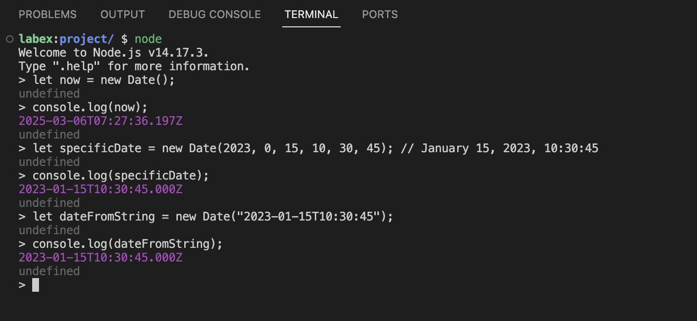

# JavaScript Date 객체 시작하기

JavaScript 는 날짜와 시간을 다룰 수 있는 내장 `Date` 객체를 제공합니다. 날짜 간의 차이를 계산하기 전에 먼저 JavaScript 에서 Date 객체를 생성하고 사용하는 방법을 이해해 보겠습니다.

## Node.js 환경 시작하기

대화형 Node.js 환경을 열어 시작해 보겠습니다.

1. WebIDE 상단의 Terminal 메뉴를 클릭하여 터미널을 엽니다.
2. 다음 명령을 입력하고 Enter 키를 누릅니다.

```bash
node
```

이제 JavaScript 대화형 환경에 있음을 나타내는 Node.js 프롬프트 (`>`) 가 표시됩니다. 이를 통해 터미널에서 JavaScript 코드를 직접 실행할 수 있습니다.



## Date 객체 생성하기

JavaScript 에서 새로운 Date 객체를 여러 가지 방법으로 생성할 수 있습니다.

```javascript
// 현재 날짜 및 시간
let now = new Date();
console.log(now);

// 특정 날짜 및 시간 (년, 월 [0-11], 일, 시, 분, 초)
let specificDate = new Date(2023, 0, 15, 10, 30, 45); // 2023 년 1 월 15 일, 10:30:45
console.log(specificDate);

// 문자열로부터의 날짜
let dateFromString = new Date("2023-01-15T10:30:45");
console.log(dateFromString);
```

Node.js 환경에서 각 예제를 입력하고 출력을 관찰해 보세요.

JavaScript 에서 월은 0 부터 시작하므로 1 월은 0, 2 월은 1 등으로 시작합니다.

## Date 객체에서 타임스탬프 얻기

JavaScript 의 모든 Date 객체는 내부적으로 1970 년 1 월 1 일 (UTC) 이후 경과된 밀리초 수를 시간으로 저장합니다. 이를 타임스탬프 (timestamp) 라고 합니다.

```javascript
let now = new Date();
console.log(now.getTime()); // 밀리초 단위의 타임스탬프 얻기
```

이 타임스탬프는 날짜 간의 차이를 계산하는 데 유용합니다.
