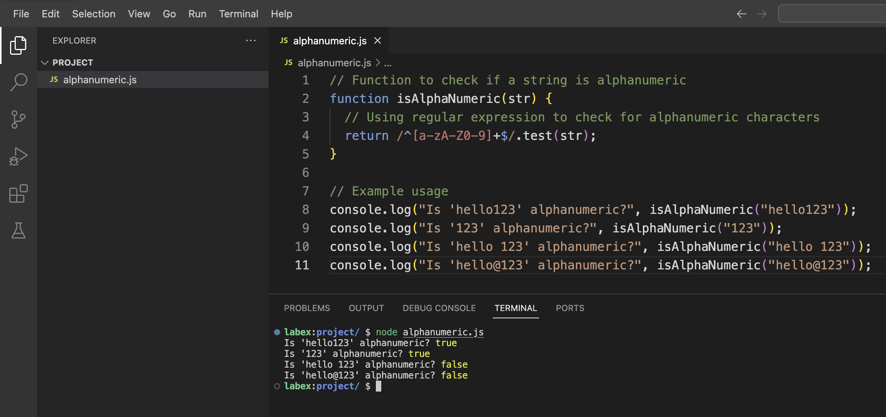

# Comprendre les caractères alphanumériques

Les caractères alphanumériques sont composés des 26 lettres de l'alphabet anglais (en majuscules de A à Z et en minuscules de a à z) et des 10 chiffres numériques (de 0 à 9). Lorsque nous vérifions si une chaîne de caractères est alphanumérique, nous vérifions qu'elle ne contient que ces caractères et rien d'autre.

En JavaScript, nous pouvons vérifier les caractères alphanumériques à l'aide d'expressions régulières. Les expressions régulières (regex) sont des modèles utilisés pour correspondre à des combinaisons de caractères dans les chaînes de caractères.

Commençons par ouvrir notre éditeur de code. Dans le WebIDE, accédez à l'explorateur de fichiers sur le côté gauche et créez un nouveau fichier JavaScript :

1. Cliquez avec le bouton droit dans le panneau de l'explorateur de fichiers
2. Sélectionnez "Nouveau fichier"
3. Nommez le fichier `alphanumeric.js`

Une fois que vous avez créé le fichier, il devrait s'ouvrir automatiquement dans l'éditeur. Sinon, cliquez sur `alphanumeric.js` dans l'explorateur de fichiers pour l'ouvrir.



Maintenant, entrons le code suivant :

```javascript
// Function to check if a string is alphanumeric
function isAlphaNumeric(str) {
  // Using regular expression to check for alphanumeric characters
  return /^[a-zA-Z0-9]+$/.test(str);
}

// Example usage
console.log("Is 'hello123' alphanumeric?", isAlphaNumeric("hello123"));
console.log("Is '123' alphanumeric?", isAlphaNumeric("123"));
console.log("Is 'hello 123' alphanumeric?", isAlphaNumeric("hello 123"));
console.log("Is 'hello@123' alphanumeric?", isAlphaNumeric("hello@123"));
```

Enregistrez le fichier en appuyant sur `Ctrl+S` ou en sélectionnant "Fichier" > "Enregistrer" dans le menu.

Maintenant, exécutons ce fichier JavaScript pour voir la sortie. Ouvrez le terminal dans le WebIDE en sélectionnant "Terminal" > "Nouveau terminal" dans le menu ou en appuyant sur `` Ctrl+` ``.

Dans le terminal, exécutez la commande suivante :

```bash
node alphanumeric.js
```

Vous devriez voir la sortie suivante :

```
Is 'hello123' alphanumeric? true
Is '123' alphanumeric? true
Is 'hello 123' alphanumeric? false
Is 'hello@123' alphanumeric? false
```

Cette sortie montre que notre fonction identifie correctement `hello123` et `123` comme des chaînes de caractères alphanumériques, tandis que `hello 123` (contient un espace) et `hello@123` (contient un caractère spécial @) ne sont pas alphanumériques.
