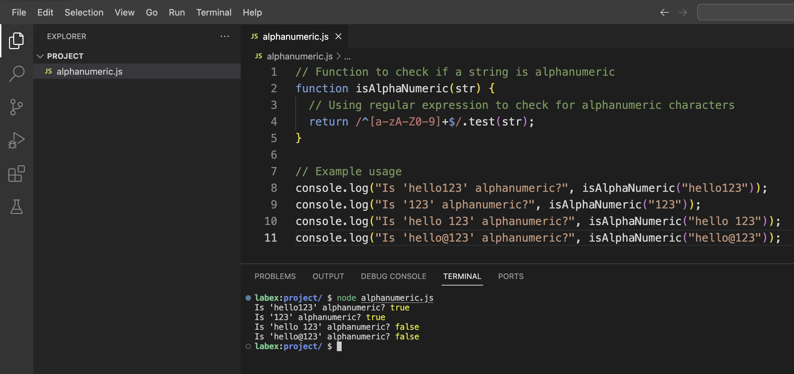

# 理解字母数字字符

字母数字字符由英语字母表中的 26 个字母（包括大写 A - Z 和小写 a - z）以及 10 个数字（0 - 9）组成。当我们检查一个字符串是否为字母数字字符串时，实际上是在验证它是否仅包含这些字符，而不包含其他内容。

在 JavaScript 中，你可以使用正则表达式来检查字母数字字符。正则表达式（regex）是用于匹配字符串中字符组合的模式。

首先，打开你的代码编辑器。在 WebIDE 中，导航到左侧的文件资源管理器，创建一个新的 JavaScript 文件：

1. 在文件资源管理器面板中右键单击
2. 选择 “New File”
3. 将文件命名为 `alphanumeric.js`

创建文件后，它应该会自动在编辑器中打开。如果没有打开，请在文件资源管理器中点击 `alphanumeric.js` 来打开它。



现在，输入以下代码：

```javascript
// Function to check if a string is alphanumeric
function isAlphaNumeric(str) {
  // Using regular expression to check for alphanumeric characters
  return /^[a-zA-Z0-9]+$/.test(str);
}

// Example usage
console.log("Is 'hello123' alphanumeric?", isAlphaNumeric("hello123"));
console.log("Is '123' alphanumeric?", isAlphaNumeric("123"));
console.log("Is 'hello 123' alphanumeric?", isAlphaNumeric("hello 123"));
console.log("Is 'hello@123' alphanumeric?", isAlphaNumeric("hello@123"));
```

按 `Ctrl + S` 或从菜单中选择 “File” > “Save” 来保存文件。

现在，运行这个 JavaScript 文件以查看输出。通过从菜单中选择 “Terminal” > “New Terminal” 或按 `` Ctrl+` `` 来在 WebIDE 中打开终端。

在终端中，执行以下命令：

```bash
node alphanumeric.js
```

你应该会看到以下输出：

```
Is 'hello123' alphanumeric? true
Is '123' alphanumeric? true
Is 'hello 123' alphanumeric? false
Is 'hello@123' alphanumeric? false
```

这个输出表明，我们的函数能够正确识别 `hello123` 和 `123` 为字母数字字符串，而 `hello 123`（包含空格）和 `hello@123`（包含特殊字符 @）不是字母数字字符串。
