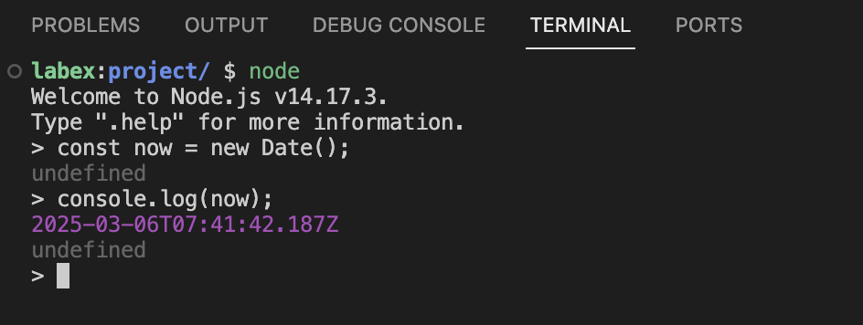

# Verständnis des ISO-Datumsformats und von JavaScript-Date-Objekten

Bevor wir mit dem Codieren beginnen, lernen wir zunächst, was das ISO 8601-Datumsformat ist und wie JavaScript mit Datumsangaben umgeht.

## Das ISO 8601-Datumsformat

Das ISO 8601-Format ist ein internationaler Standard zur Darstellung von Daten und Zeiten. Das vereinfachte erweiterte ISO-Format sieht wie folgt aus:

```
YYYY-MM-DDTHH:mm:ss.sssZ
```

Dabei bedeuten:

- `YYYY` steht für das Jahr (vier Ziffern)
- `MM` steht für den Monat (zwei Ziffern)
- `DD` steht für den Tag (zwei Ziffern)
- `T` ist ein Literalzeichen, das Datum und Zeit trennt
- `HH` steht für die Stunden (zwei Ziffern)
- `mm` steht für die Minuten (zwei Ziffern)
- `ss` steht für die Sekunden (zwei Ziffern)
- `sss` steht für die Millisekunden (drei Ziffern)
- `Z` gibt die UTC-Zeitzone (Zulu-Zeit) an

Beispielsweise repräsentiert `2023-05-12T14:30:15.123Z` den 12. Mai 2023, 14:30:15.123 Uhr UTC.

## Das JavaScript-Date-Objekt

JavaScript bietet ein eingebautes `Date`-Objekt für die Arbeit mit Daten und Zeiten. Wenn Sie ein neues `Date`-Objekt erstellen, können Sie ihm einen ISO-formatierte Zeichenkette übergeben:

```javascript
const date = new Date("2023-05-12T14:30:15.123Z");
```

Öffnen wir das Terminal und üben die Arbeit mit Date-Objekten:

1. Öffnen Sie das Terminal, indem Sie auf das Terminal-Menü oben im WebIDE klicken.
2. Geben Sie `node` ein und drücken Sie die Eingabetaste, um die Node.js interaktive Shell zu starten.
3. Erstellen Sie ein neues Date-Objekt für die aktuelle Zeit:

```javascript
const now = new Date();
console.log(now);
```



4. Konvertieren Sie dieses Date-Objekt in eine ISO-Zeichenkette:

```javascript
const isoString = now.toISOString();
console.log(isoString);
```

Sie sollten eine Ausgabe ähnlich der folgenden sehen:

```
2023-05-12T14:30:15.123Z
```

5. Erstellen Sie ein Date-Objekt aus einer ISO-Zeichenkette:

```javascript
const dateFromIso = new Date("2023-05-12T14:30:15.123Z");
console.log(dateFromIso);
```


Dies zeigt, wie JavaScript ISO-formatierte Zeichenketten analysieren und daraus Date-Objekte erstellen kann.
