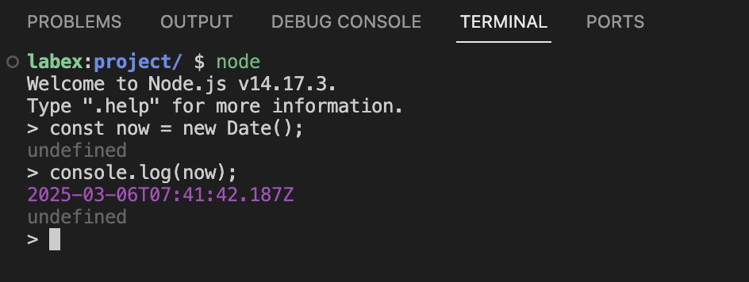
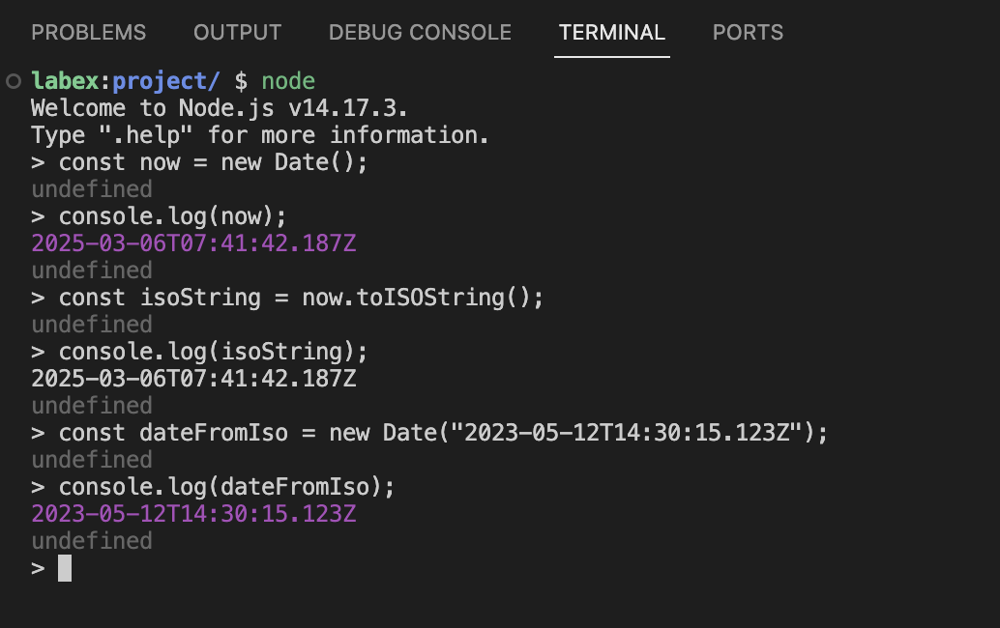

# ISO 날짜 형식 및 JavaScript Date 객체 이해

코딩을 시작하기 전에 ISO 8601 날짜 형식이 무엇인지, 그리고 JavaScript 가 날짜를 어떻게 처리하는지 이해해 보겠습니다.

## ISO 8601 날짜 형식

ISO 8601 형식은 날짜와 시간을 나타내기 위한 국제 표준입니다. 단순 확장 ISO 형식은 다음과 같습니다.

```
YYYY-MM-DDTHH:mm:ss.sssZ
```

여기서:

- `YYYY`는 연도 (4 자리) 를 나타냅니다.
- `MM`은 월 (2 자리) 을 나타냅니다.
- `DD`는 일 (2 자리) 을 나타냅니다.
- `T`는 날짜와 시간을 구분하는 문자입니다.
- `HH`는 시 (2 자리) 를 나타냅니다.
- `mm`은 분 (2 자리) 을 나타냅니다.
- `ss`는 초 (2 자리) 를 나타냅니다.
- `sss`는 밀리초 (3 자리) 를 나타냅니다.
- `Z`는 UTC 시간대 (Zulu time) 를 나타냅니다.

예를 들어, `2023-05-12T14:30:15.123Z`는 2023 년 5 월 12 일 오후 2 시 30 분 15.123 초 UTC 를 나타냅니다.

## JavaScript Date 객체

JavaScript 는 날짜와 시간을 처리하기 위한 내장 `Date` 객체를 제공합니다. 새로운 `Date` 객체를 생성할 때 ISO 형식 문자열을 전달할 수 있습니다.

```javascript
const date = new Date("2023-05-12T14:30:15.123Z");
```

터미널을 열고 Date 객체로 작업하는 연습을 해보겠습니다.

1. WebIDE 상단의 터미널 메뉴를 클릭하여 터미널을 엽니다.
2. `node`를 입력하고 Enter 키를 눌러 Node.js 대화형 셸을 시작합니다.
3. 현재 시간에 대한 새로운 Date 객체를 생성합니다.

```javascript
const now = new Date();
console.log(now);
```



4. 이 Date 객체를 ISO 문자열로 변환합니다.

```javascript
const isoString = now.toISOString();
console.log(isoString);
```

다음과 유사한 출력을 볼 수 있습니다.

```
2023-05-12T14:30:15.123Z
```

5. ISO 문자열에서 Date 를 생성합니다.

```javascript
const dateFromIso = new Date("2023-05-12T14:30:15.123Z");
console.log(dateFromIso);
```



이것은 JavaScript 가 ISO 형식 문자열에서 Date 객체를 파싱하고 생성할 수 있는 방법을 보여줍니다.
