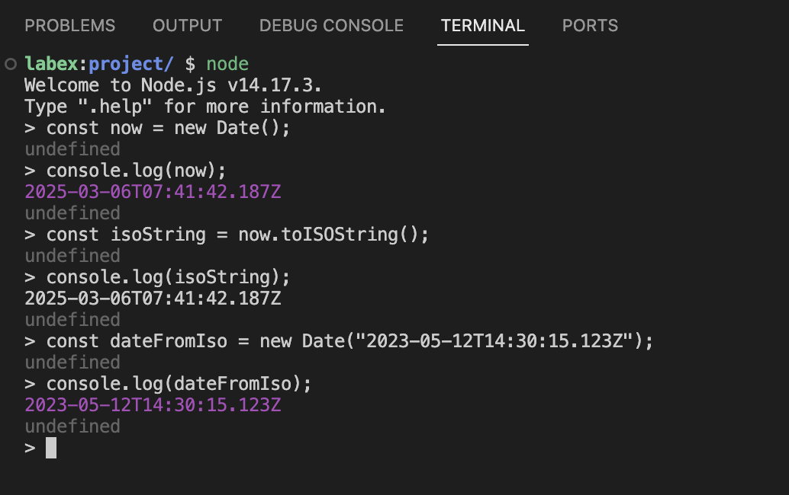

# Понимание формата дат ISO и объектов Date в JavaScript

Перед тем, как мы начнем писать код, давайте разберемся, что такое формат дат ISO 8601 и как JavaScript работает с датами.

## Формат дат ISO 8601

Формат ISO 8601 представляет собой международный стандарт для представления дат и времени. Упрощенный расширенный формат ISO выглядит следующим образом:

```
YYYY-MM-DDTHH:mm:ss.sssZ
```

Где:

- `YYYY` представляет год (четыре цифры)
- `MM` представляет месяц (две цифры)
- `DD` представляет день (две цифры)
- `T` - это литеральный символ, разделяющий дату и время
- `HH` представляет часы (две цифры)
- `mm` представляет минуты (две цифры)
- `ss` представляет секунды (две цифры)
- `sss` представляет миллисекунды (три цифры)
- `Z` указывает на часовой пояс UTC (Зульский час)

Например, `2023-05-12T14:30:15.123Z` представляет 12 мая 2023 года, 14:30:15.123 по UTC.

## Объект Date в JavaScript

JavaScript предоставляет встроенный объект `Date` для работы с датами и временем. Когда вы создаете новый объект `Date`, вы можете передать ему строку в формате ISO:

```javascript
const date = new Date("2023-05-12T14:30:15.123Z");
```

Давайте откроем терминал и потренируемся работать с объектами Date:

1. Откройте терминал, нажав на меню "Terminal" в верхней части WebIDE.
2. Введите `node` и нажмите Enter, чтобы запустить интерактивную оболочку Node.js.
3. Создайте новый объект Date для текущего времени:

```javascript
const now = new Date();
console.log(now);
```


4. Преобразуйте этот объект Date в строку в формате ISO:

```javascript
const isoString = now.toISOString();
console.log(isoString);
```

Вы должны увидеть вывод, похожий на следующий:

```
2023-05-12T14:30:15.123Z
```

5. Создайте объект Date из строки в формате ISO:

```javascript
const dateFromIso = new Date("2023-05-12T14:30:15.123Z");
console.log(dateFromIso);
```



Это демонстрирует, как JavaScript может разбирать и создавать объекты Date из строк в формате ISO.
