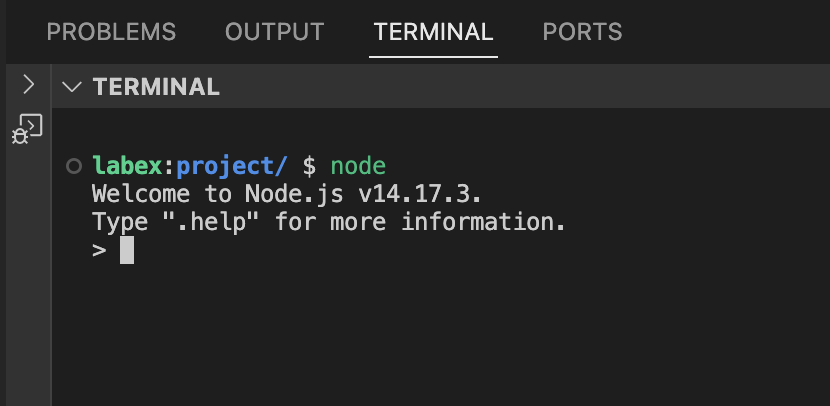
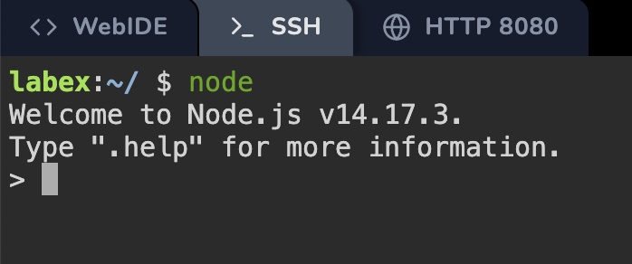

# Variables

> Open the Terminal/SSH and type node to start practicing coding.

> 

> 

Variables are containers that store values. You start by declaring a variable with the [`let`](/en-US/docs/Web/JavaScript/Reference/Statements/let) keyword, followed by the name you give to the variable:

```js
let myVariable;
```

A semicolon at the end of a line indicates where a statement ends. It is only required when you need to separate statements on a single line. However, some people believe it's good practice to have semicolons at the end of each statement. There are other rules for when you should and shouldn't use semicolons. For more details, see [Your Guide to Semicolons in JavaScript](https://www.codecademy.com/resources/blog/your-guide-to-semicolons-in-javascript/).

You can name a variable nearly anything, but there are some restrictions. (See [this section about naming rules](/en-US/docs/Web/JavaScript/Guide/Grammar_and_types#variables).) If you are unsure, you can [check your variable name](https://mothereff.in/js-variables) to see if it's valid.

JavaScript is case sensitive. This means `myVariable` is not the same as `myvariable`. If you have problems in your code, check the case!

After declaring a variable, you can give it a value:

```js
myVariable = "Bob";
```

Also, you can do both these operations on the same line:

```js
let myVariable = "Bob";
```

You retrieve the value by calling the variable name:

```js
myVariable;
```

After assigning a value to a variable, you can change it later in the code:

```js
let myVariable = "Bob";
myVariable = "Steve";
```

Note that variables may hold values that have different [data types](/en-US/docs/Web/JavaScript/Data_structures):

| Variable                                                             | Explanation                                                                                                                      | Example                                                                                                                     |
| -------------------------------------------------------------------- | -------------------------------------------------------------------------------------------------------------------------------- | --------------------------------------------------------------------------------------------------------------------------- |
| [String](https://developer.mozilla.org/en-US/docs/Glossary/String)   | This is a sequence of text known as a string. To signify that the value is a string, enclose it in single or double quote marks. | `let myVariable = 'Bob';` or `let myVariable = "Bob";`                                                                      |
| [Number](https://developer.mozilla.org/en-US/docs/Glossary/Number)   | This is a number. Numbers don't have quotes around them.                                                                         | `let myVariable = 10;`                                                                                                      |
| [Boolean](https://developer.mozilla.org/en-US/docs/Glossary/Boolean) | This is a True/False value. The words `true` and `false` are special keywords that don't need quote marks.                       | `let myVariable = true;`                                                                                                    |
| [Array](https://developer.mozilla.org/en-US/docs/Glossary/Array)     | This is a structure that allows you to store multiple values in a single reference.                                              | `let myVariable = [1,'Bob','Steve',10];` Refer to each member of the array like this:`myVariable[0]`, `myVariable[1]`, etc. |
| [Object](https://developer.mozilla.org/en-US/docs/Glossary/Object)   | This can be anything. Everything in JavaScript is an object and can be stored in a variable. Keep this in mind as you learn.     | `let myVariable = document.querySelector('h1');` All of the above examples too.                                             |

So why do we need variables? Variables are necessary to do anything interesting in programming. If values couldn't change, then you couldn't do anything dynamic, like personalize a greeting message or change an image displayed in an image gallery.
