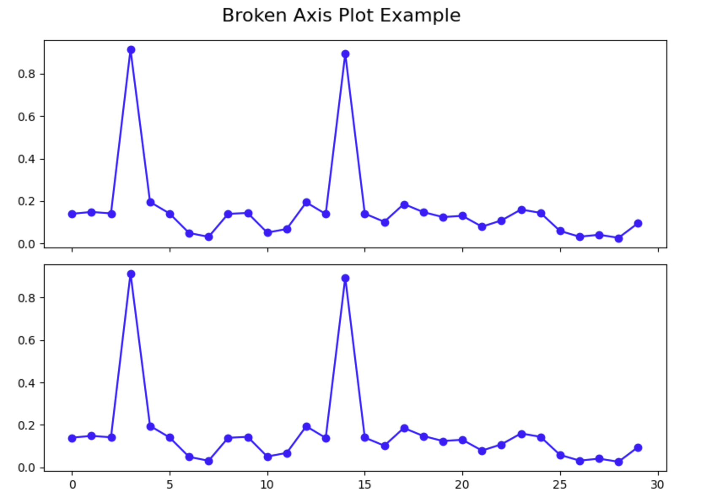

# Creating and Configuring the Broken Axis Plot

In this step, we will create the actual broken axis plot structure. A broken axis plot consists of multiple subplots that show different ranges of the same data. We will configure these subplots to display our main data and outliers effectively.

## Create the Subplots

First, we need to create two subplots arranged vertically. The top subplot will display our outliers, while the bottom subplot will show the majority of our data points.

Create a new cell in your notebook and add the following code:

```python
# Create two subplots stacked vertically with shared x-axis
fig, (ax1, ax2) = plt.subplots(2, 1, sharex=True, figsize=(8, 6))

# Add a main title to the figure
fig.suptitle('Broken Axis Plot Example', fontsize=16)

# Plot the same data on both axes
ax1.plot(pts, 'o-', color='blue')
ax2.plot(pts, 'o-', color='blue')

# Display the figure to see both subplots
plt.tight_layout()
plt.show()
```



When you run this cell, you should see a figure with two subplots, both showing the same data. Notice how the outliers compress the rest of the data in both plots, making it difficult to see the details of the majority of data points. This is exactly the problem we're trying to solve with a broken axis plot.

## Configure the Y-Axis Limits

Now we need to configure each subplot to focus on a specific range of y-values. The top subplot will focus on the outlier range, while the bottom subplot will focus on the main data range.

Create a new cell and add the following code:

```python
# Create two subplots stacked vertically with shared x-axis
fig, (ax1, ax2) = plt.subplots(2, 1, sharex=True, figsize=(8, 6))

# Plot the same data on both axes
ax1.plot(pts, 'o-', color='blue')
ax2.plot(pts, 'o-', color='blue')

# Set y-axis limits for each subplot
ax1.set_ylim(0.78, 1.0)    # Top subplot shows only the outliers
ax2.set_ylim(0, 0.22)      # Bottom subplot shows only the main data

# Add a title to each subplot
ax1.set_title('Outlier Region')
ax2.set_title('Main Data Region')

# Display the figure with adjusted y-axis limits
plt.tight_layout()
plt.show()
```

When you run this cell, you should see that each subplot now focuses on a different range of y-values. The top plot shows only the outliers, and the bottom plot shows only the main data. This already improves the visualization, but to make it a proper broken axis plot, we need to add a few more configurations.

## Hide the Spines and Adjust the Ticks

To create the illusion of a "broken" axis, we need to hide the connecting spines between the two subplots and adjust the tick positions.

Create a new cell and add the following code:

```python
# Create two subplots stacked vertically with shared x-axis
fig, (ax1, ax2) = plt.subplots(2, 1, sharex=True, figsize=(8, 6))

# Plot the same data on both axes
ax1.plot(pts, 'o-', color='blue')
ax2.plot(pts, 'o-', color='blue')

# Set y-axis limits for each subplot
ax1.set_ylim(0.78, 1.0)    # Top subplot shows only the outliers
ax2.set_ylim(0, 0.22)      # Bottom subplot shows only the main data

# Hide the spines between ax1 and ax2
ax1.spines.bottom.set_visible(False)
ax2.spines.top.set_visible(False)

# Adjust the position of the ticks
ax1.xaxis.tick_top()          # Move x-axis ticks to the top
ax1.tick_params(labeltop=False)  # Hide x-axis tick labels at the top
ax2.xaxis.tick_bottom()       # Keep x-axis ticks at the bottom

# Add labels to the plot
ax2.set_xlabel('Data Point Index')
ax2.set_ylabel('Value')
ax1.set_ylabel('Value')

plt.tight_layout()
plt.show()
```

When you run this cell, you should see that the plot now has hidden spines between the two subplots, creating a cleaner appearance. The x-axis ticks are now positioned correctly, with labels only at the bottom.

At this point, we have successfully created a basic broken axis plot. In the next step, we will add finishing touches to make it clear to viewers that the axis is broken.
