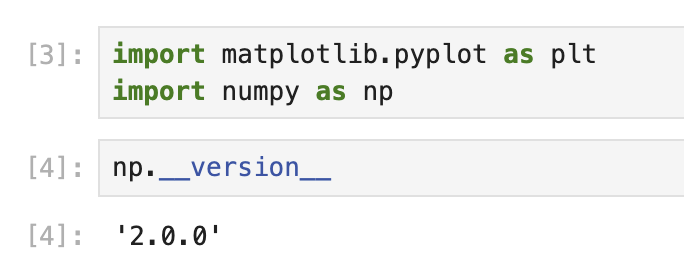

# Preparando el entorno y creando datos

En este primer paso, configuraremos nuestro entorno de trabajo importando las bibliotecas necesarias y creando datos de muestra para nuestra visualización. Nos centraremos en generar datos que incluyan algunos valores atípicos (outliers), lo que demostrará el valor de utilizar un gráfico con eje roto.

## Importar las bibliotecas requeridas

Comencemos importando las bibliotecas que necesitamos para este tutorial. Utilizaremos Matplotlib para crear nuestras visualizaciones y NumPy para generar y manipular datos numéricos.

Crea una nueva celda en tu Jupyter Notebook y escribe el siguiente código:

```python
import matplotlib.pyplot as plt
import numpy as np

print(f"NumPy version: {np.__version__}")
```

Cuando ejecutes esta celda, deberías ver una salida similar a esta:

```
NumPy version: 2.0.0
```



Los números exactos de la versión pueden variar dependiendo de tu entorno, pero esto confirma que las bibliotecas están instaladas correctamente y listas para usar.

## Generar datos de muestra con valores atípicos

Ahora, creemos un conjunto de datos de muestra que incluya algunos valores atípicos. Generaremos números aleatorios y luego agregaremos deliberadamente valores más grandes en ciertas posiciones para crear nuestros valores atípicos.

Crea una nueva celda y agrega el siguiente código:

```python
# Establece una semilla aleatoria para reproducibilidad
np.random.seed(19680801)

# Genera 30 puntos aleatorios con valores entre 0 y 0.2
pts = np.random.rand(30) * 0.2

# Agrega 0.8 a dos puntos específicos para crear valores atípicos
pts[[3, 14]] += 0.8

# Muestra los primeros puntos de datos para entender nuestro conjunto de datos
print("First 10 data points:")
print(pts[:10])
print("\nData points containing outliers:")
print(pts[[3, 14]])
```

Cuando ejecutes esta celda, deberías ver una salida similar a:

```
First 10 data points:
[0.01182225 0.11765474 0.07404329 0.91088185 0.10502995 0.11190702
 0.14047499 0.01060192 0.15226977 0.06145634]

Data points containing outliers:
[0.91088185 0.97360754]
```

En esta salida, puedes ver claramente que los valores en los índices 3 y 14 son mucho más grandes que los otros valores. Estos son nuestros valores atípicos. La mayoría de nuestros puntos de datos están por debajo de 0.2, pero estos dos valores atípicos están por encima de 0.9, creando una disparidad significativa en nuestro conjunto de datos.

Este tipo de distribución de datos es perfecto para demostrar la utilidad de un gráfico con eje roto. En el siguiente paso, crearemos la estructura del gráfico y lo configuraremos para mostrar adecuadamente tanto los datos principales como los valores atípicos.
