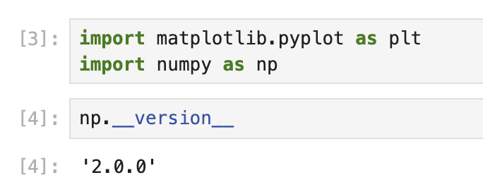

# Préparation de l'environnement et création de données

Dans cette première étape, nous allons configurer notre environnement de travail en important les bibliothèques nécessaires et en créant des données d'exemple pour notre visualisation. Nous allons nous concentrer sur la génération de données qui incluent quelques valeurs aberrantes (outliers), ce qui démontrera l'intérêt d'utiliser un graphique à axe brisé.

## Importation des bibliothèques requises

Commençons par importer les bibliothèques dont nous avons besoin pour ce tutoriel. Nous utiliserons Matplotlib pour créer nos visualisations et NumPy pour générer et manipuler des données numériques.

Créez une nouvelle cellule dans votre Jupyter Notebook et tapez le code suivant :

```python
import matplotlib.pyplot as plt
import numpy as np

print(f"NumPy version: {np.__version__}")
```

Lorsque vous exécutez cette cellule, vous devriez voir une sortie similaire à ceci :

```
NumPy version: 2.0.0
```



Les numéros de version exacts peuvent varier en fonction de votre environnement, mais cela confirme que les bibliothèques sont correctement installées et prêtes à être utilisées.

## Génération de données d'exemple avec des valeurs aberrantes

Maintenant, créons un jeu de données d'exemple qui inclut quelques valeurs aberrantes. Nous allons générer des nombres aléatoires, puis ajouter délibérément des valeurs plus grandes à certaines positions pour créer nos valeurs aberrantes.

Créez une nouvelle cellule et ajoutez le code suivant :

```python
# Set random seed for reproducibility
np.random.seed(19680801)

# Generate 30 random points with values between 0 and 0.2
pts = np.random.rand(30) * 0.2

# Add 0.8 to two specific points to create outliers
pts[[3, 14]] += 0.8

# Display the first few data points to understand our dataset
print("First 10 data points:")
print(pts[:10])
print("\nData points containing outliers:")
print(pts[[3, 14]])
```

Lorsque vous exécutez cette cellule, vous devriez voir une sortie similaire à :

```
First 10 data points:
[0.01182225 0.11765474 0.07404329 0.91088185 0.10502995 0.11190702
 0.14047499 0.01060192 0.15226977 0.06145634]

Data points containing outliers:
[0.91088185 0.97360754]
```

Dans cette sortie, vous pouvez clairement voir que les valeurs aux indices 3 et 14 sont beaucoup plus grandes que les autres valeurs. Ce sont nos valeurs aberrantes. La plupart de nos points de données sont inférieurs à 0,2, mais ces deux valeurs aberrantes sont supérieures à 0,9, créant une disparité significative dans notre jeu de données.

Ce type de distribution de données est parfait pour démontrer l'utilité d'un graphique à axe brisé. Dans l'étape suivante, nous allons créer la structure du graphique et la configurer pour afficher correctement à la fois les données principales et les valeurs aberrantes.
