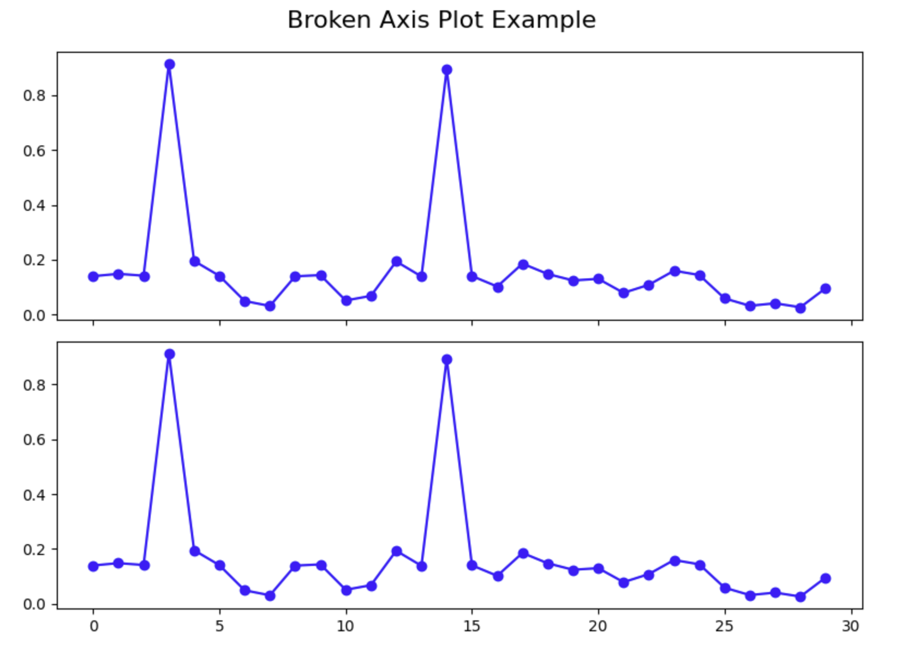

# Criando e Configurando o Gráfico com Eixo Quebrado

Nesta etapa, criaremos a estrutura real do gráfico com eixo quebrado. Um gráfico com eixo quebrado consiste em múltiplos _subplots_ (subgráficos) que mostram diferentes intervalos dos mesmos dados. Configuraremos esses _subplots_ para exibir nossos dados principais e _outliers_ de forma eficaz.

## Criando os _Subplots_

Primeiramente, precisamos criar dois _subplots_ dispostos verticalmente. O _subplot_ superior exibirá nossos _outliers_, enquanto o _subplot_ inferior mostrará a maioria dos nossos pontos de dados.

Crie uma nova célula no seu notebook e adicione o seguinte código:

```python
# Create two subplots stacked vertically with shared x-axis
fig, (ax1, ax2) = plt.subplots(2, 1, sharex=True, figsize=(8, 6))

# Add a main title to the figure
fig.suptitle('Broken Axis Plot Example', fontsize=16)

# Plot the same data on both axes
ax1.plot(pts, 'o-', color='blue')
ax2.plot(pts, 'o-', color='blue')

# Display the figure to see both subplots
plt.tight_layout()
plt.show()
```



Ao executar esta célula, você deverá ver uma figura com dois _subplots_, ambos mostrando os mesmos dados. Observe como os _outliers_ comprimem o restante dos dados em ambos os gráficos, tornando difícil ver os detalhes da maioria dos pontos de dados. Este é exatamente o problema que estamos tentando resolver com um gráfico com eixo quebrado.

## Configurando os Limites do Eixo Y

Agora precisamos configurar cada _subplot_ para focar em um intervalo específico de valores y. O _subplot_ superior se concentrará no intervalo de _outliers_, enquanto o _subplot_ inferior se concentrará no intervalo de dados principais.

Crie uma nova célula e adicione o seguinte código:

```python
# Create two subplots stacked vertically with shared x-axis
fig, (ax1, ax2) = plt.subplots(2, 1, sharex=True, figsize=(8, 6))

# Plot the same data on both axes
ax1.plot(pts, 'o-', color='blue')
ax2.plot(pts, 'o-', color='blue')

# Set y-axis limits for each subplot
ax1.set_ylim(0.78, 1.0)    # Top subplot shows only the outliers
ax2.set_ylim(0, 0.22)      # Bottom subplot shows only the main data

# Add a title to each subplot
ax1.set_title('Outlier Region')
ax2.set_title('Main Data Region')

# Display the figure with adjusted y-axis limits
plt.tight_layout()
plt.show()
```

Ao executar esta célula, você deverá ver que cada _subplot_ agora se concentra em um intervalo diferente de valores y. O gráfico superior mostra apenas os _outliers_, e o gráfico inferior mostra apenas os dados principais. Isso já melhora a visualização, mas para torná-lo um gráfico com eixo quebrado adequado, precisamos adicionar mais algumas configurações.

## Ocultando as _Spines_ e Ajustando as Marcas de Escala

Para criar a ilusão de um eixo "quebrado", precisamos ocultar as _spines_ (bordas) de conexão entre os dois _subplots_ e ajustar as posições das marcas de escala.

Crie uma nova célula e adicione o seguinte código:

```python
# Create two subplots stacked vertically with shared x-axis
fig, (ax1, ax2) = plt.subplots(2, 1, sharex=True, figsize=(8, 6))

# Plot the same data on both axes
ax1.plot(pts, 'o-', color='blue')
ax2.plot(pts, 'o-', color='blue')

# Set y-axis limits for each subplot
ax1.set_ylim(0.78, 1.0)    # Top subplot shows only the outliers
ax2.set_ylim(0, 0.22)      # Bottom subplot shows only the main data

# Hide the spines between ax1 and ax2
ax1.spines.bottom.set_visible(False)
ax2.spines.top.set_visible(False)

# Adjust the position of the ticks
ax1.xaxis.tick_top()          # Move x-axis ticks to the top
ax1.tick_params(labeltop=False)  # Hide x-axis tick labels at the top
ax2.xaxis.tick_bottom()       # Keep x-axis ticks at the bottom

# Add labels to the plot
ax2.set_xlabel('Data Point Index')
ax2.set_ylabel('Value')
ax1.set_ylabel('Value')

plt.tight_layout()
plt.show()
```

Ao executar esta célula, você deverá ver que o gráfico agora tem _spines_ ocultas entre os dois _subplots_, criando uma aparência mais limpa. As marcas de escala do eixo x agora estão posicionadas corretamente, com rótulos apenas na parte inferior.

Neste ponto, criamos com sucesso um gráfico com eixo quebrado básico. Na próxima etapa, adicionaremos os toques finais para deixar claro aos espectadores que o eixo está quebrado.
