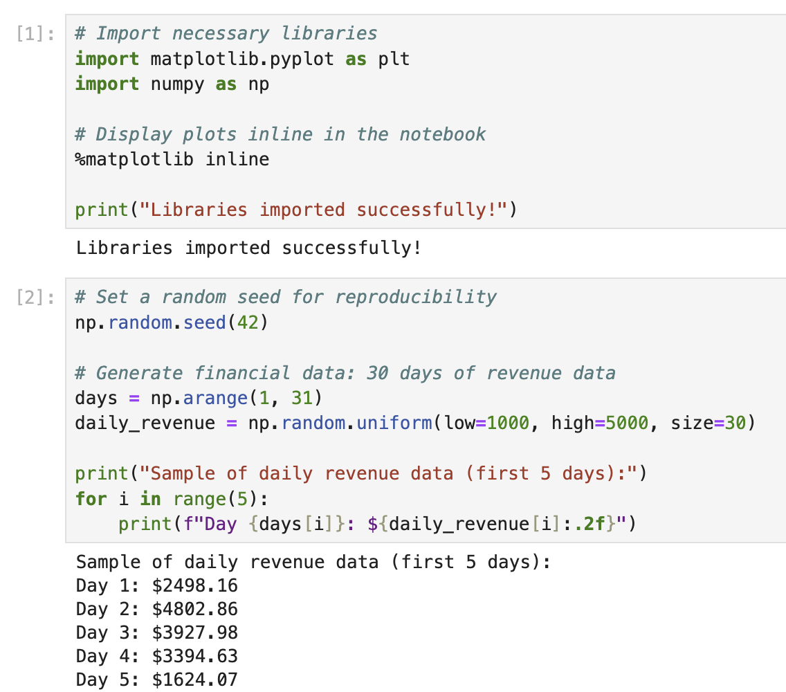

# Configuration des bibliothèques et création de données d'exemple

Dans cette première étape, nous allons importer les bibliothèques nécessaires et créer des données financières d'exemple pour notre graphique. Nous devons importer à la fois Matplotlib pour la visualisation et NumPy pour la génération de données.

Dans la première cellule de votre notebook, entrez et exécutez le code suivant pour importer les bibliothèques requises :

```python
# Import necessary libraries
import matplotlib.pyplot as plt
import numpy as np

# Display plots inline in the notebook
%matplotlib inline

print("Libraries imported successfully!")
```

Après avoir exécuté le code (appuyez sur Shift+Enter), vous devriez voir la sortie suivante :

```
Libraries imported successfully!
```



Maintenant, créons des données financières d'exemple à visualiser. Les données financières représentent souvent des valeurs au fil du temps, nous allons donc créer un simple ensemble de données qui pourrait représenter le chiffre d'affaires quotidien sur une période donnée.

Dans une nouvelle cellule, ajoutez et exécutez le code suivant :

```python
# Set a random seed for reproducibility
np.random.seed(42)

# Generate financial data: 30 days of revenue data
days = np.arange(1, 31)
daily_revenue = np.random.uniform(low=1000, high=5000, size=30)

print("Sample of daily revenue data (first 5 days):")
for i in range(5):
    print(f"Day {days[i]}: ${daily_revenue[i]:.2f}")
```

Après avoir exécuté ce code, vous verrez les 5 premiers jours de nos données de chiffre d'affaires d'exemple :

```
Sample of daily revenue data (first 5 days):
Day 1: $3745.40
Day 2: $3992.60
Day 3: $2827.45
Day 4: $4137.54
Day 5: $1579.63
```

Ces données d'exemple représentent les valeurs de chiffre d'affaires quotidien entre 1 000 $ et 5 000 $ sur une période de 30 jours. Nous utiliserons ces données pour créer notre graphique à l'étape suivante.
