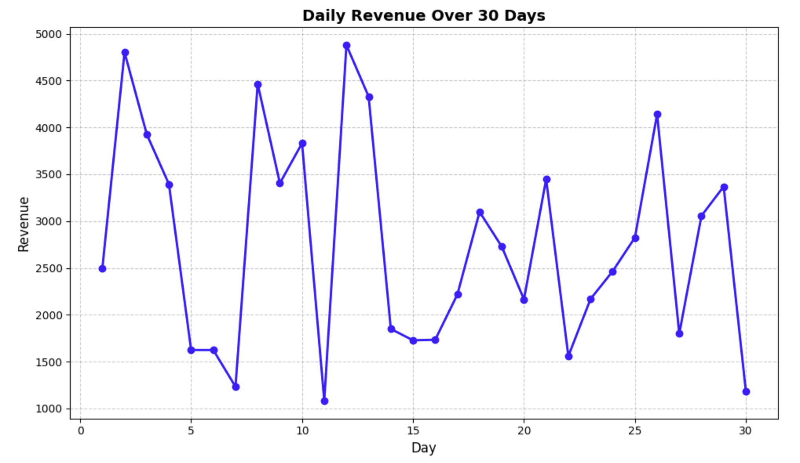

# 基本的な金融プロットの作成

データが用意できたので、日次収益を可視化する基本的なプロットを作成しましょう。30 日間の収益トレンドを示す単純な折れ線グラフから始めます。

ノートブックの新しいセルに以下のコードを追加して実行します。

```python
# Create a figure and axes
fig, ax = plt.subplots(figsize=(10, 6))

# Plot the daily revenue data
ax.plot(days, daily_revenue, marker='o', linestyle='-', color='blue', linewidth=2, markersize=6)

# Add labels and title
ax.set_xlabel('Day', fontsize=12)
ax.set_ylabel('Revenue', fontsize=12)
ax.set_title('Daily Revenue Over 30 Days', fontsize=14, fontweight='bold')

# Add grid for better readability
ax.grid(True, linestyle='--', alpha=0.7)

# Display the plot
plt.tight_layout()
plt.show()

print("Basic plot created successfully!")
```

このコードを実行すると、日次収益のトレンドを示す折れ線グラフが表示されるはずです。このグラフは次のようになります（実際の値は乱数生成のため多少異なる場合があります）。



このコードで行ったことを分解して説明しましょう。

1. `fig, ax = plt.subplots(figsize=(10, 6))` - サイズが 10×6 インチの図と軸を作成しました。
2. `ax.plot(days, daily_revenue, ...)` - x 軸に日付、y 軸に収益を設定してデータをプロットしました。
3. `ax.set_xlabel()`、`ax.set_ylabel()`、`ax.set_title()` - プロットにラベルとタイトルを追加しました。
4. `ax.grid()` - データを読みやすくするためにグリッドを追加しました。
5. `plt.tight_layout()` - 余白を調整してすべてがきれいに収まるようにしました。
6. `plt.show()` - プロットを表示しました。

現在、y 軸にはドル記号なしの単なる数字が表示されていることに注意してください。次のステップでは、y 軸に適切な通貨フォーマットを表示するようにプロットを修正します。
