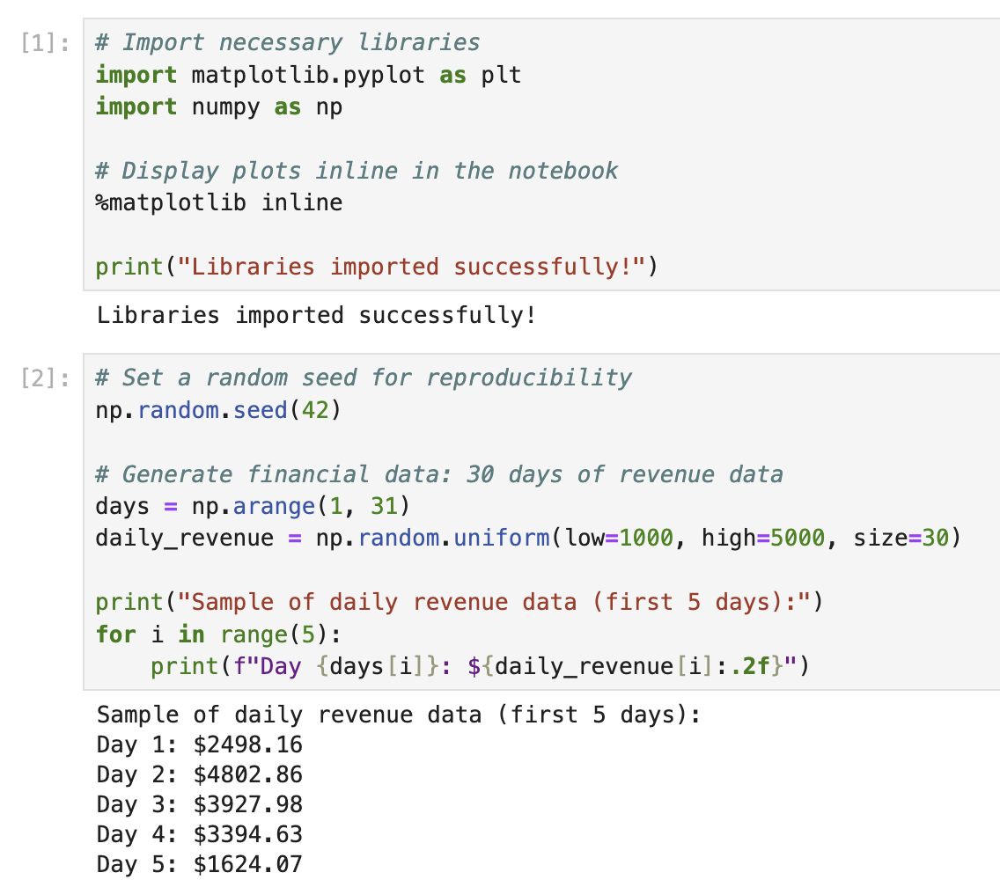

# 라이브러리 설정 및 샘플 데이터 생성

이 첫 번째 단계에서는 필요한 라이브러리를 가져오고 플롯을 위한 샘플 금융 데이터를 생성합니다. 시각화를 위해 Matplotlib 을, 데이터 생성을 위해 NumPy 를 가져와야 합니다.

노트북의 첫 번째 셀에 다음 코드를 입력하고 실행하여 필요한 라이브러리를 가져오십시오.

```python
# Import necessary libraries
import matplotlib.pyplot as plt
import numpy as np

# Display plots inline in the notebook
%matplotlib inline

print("Libraries imported successfully!")
```

코드를 실행한 후 (Shift+Enter 를 누르십시오) 다음 출력을 볼 수 있습니다.

```
Libraries imported successfully!
```



이제 시각화할 샘플 금융 데이터를 생성해 보겠습니다. 금융 데이터는 종종 시간에 따른 값을 나타내므로, 기간 동안의 일일 수익을 나타낼 수 있는 간단한 데이터 세트를 생성합니다.

새 셀에 다음 코드를 추가하고 실행합니다.

```python
# Set a random seed for reproducibility
np.random.seed(42)

# Generate financial data: 30 days of revenue data
days = np.arange(1, 31)
daily_revenue = np.random.uniform(low=1000, high=5000, size=30)

print("Sample of daily revenue data (first 5 days):")
for i in range(5):
    print(f"Day {days[i]}: ${daily_revenue[i]:.2f}")
```

이 코드를 실행하면 샘플 수익 데이터의 처음 5 일을 볼 수 있습니다.

```
Sample of daily revenue data (first 5 days):
Day 1: $3745.40
Day 2: $3992.60
Day 3: $2827.45
Day 4: $4137.54
Day 5: $1579.63
```

이 샘플 데이터는 30 일 동안 $1,000 에서 $5,000 사이의 일일 수익 값을 나타냅니다. 다음 단계에서 이 데이터를 사용하여 플롯을 생성합니다.
