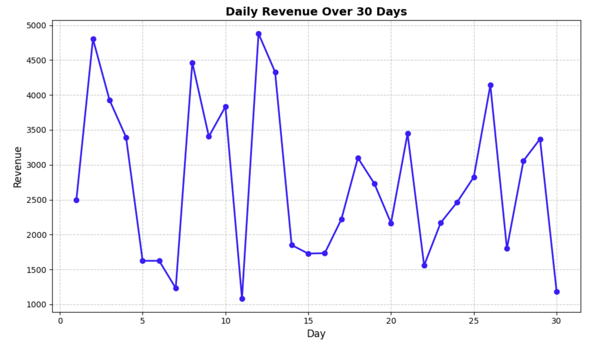

# 创建基本的金融绘图

现在我们已经准备好了数据，让我们创建一个基本的绘图来可视化每日收入。我们将从一个简单的折线图开始，展示这 30 天内的收入趋势。

在你的 Notebook 的新单元格中，添加并运行以下代码：

```python
# Create a figure and axes
fig, ax = plt.subplots(figsize=(10, 6))

# Plot the daily revenue data
ax.plot(days, daily_revenue, marker='o', linestyle='-', color='blue', linewidth=2, markersize=6)

# Add labels and title
ax.set_xlabel('Day', fontsize=12)
ax.set_ylabel('Revenue', fontsize=12)
ax.set_title('Daily Revenue Over 30 Days', fontsize=14, fontweight='bold')

# Add grid for better readability
ax.grid(True, linestyle='--', alpha=0.7)

# Display the plot
plt.tight_layout()
plt.show()

print("Basic plot created successfully!")
```

运行此代码后，你应该会看到一个显示每日收入趋势的折线图。它应该类似于下面这样（由于随机生成，实际值可能会略有不同）：



让我们来详细分析一下这段代码的操作：

1. `fig, ax = plt.subplots(figsize=(10, 6))` — 创建了一个大小为 10×6 英寸的图形和坐标轴
2. `ax.plot(days, daily_revenue, ...)` — 绘制数据，x 轴为天数，y 轴为收入
3. `ax.set_xlabel()`、`ax.set_ylabel()`、`ax.set_title()` — 为绘图添加标签和标题
4. `ax.grid()` — 添加网格，使数据更易于读取
5. `plt.tight_layout()` — 调整边距，确保所有内容布局合理
6. `plt.show()` — 显示绘图

注意，目前 y 轴显示的是普通数字，没有美元符号。在下一步中，我们将修改绘图，使 y 轴显示正确的货币格式。
