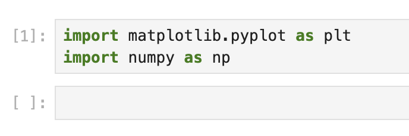

# Erstellen eines Jupyter Notebooks und Vorbereiten der Daten

In diesem ersten Schritt werden wir ein neues Jupyter Notebook erstellen und unsere Daten für die Visualisierung vorbereiten.

## Erstellen eines neuen Notebooks

In der ersten Zelle des Notebooks importieren wir die erforderlichen Bibliotheken. Geben Sie den folgenden Code ein und führen Sie ihn aus, indem Sie auf die Schaltfläche "Run" klicken oder Shift+Enter drücken:

```python
import matplotlib.pyplot as plt
import numpy as np
```



Dieser Code importiert zwei essentielle Bibliotheken:

- `matplotlib.pyplot`: Eine Sammlung von Funktionen, die matplotlib wie MATLAB funktionieren lassen
- `numpy`: Ein grundlegendes Paket für wissenschaftliche Berechnungen in Python

## Erstellen von Beispieldaten

Jetzt erstellen wir einige Beispieldaten, die wir visualisieren werden. Geben Sie in einer neuen Zelle den folgenden Code ein und führen Sie ihn aus:

```python
# Set a random seed for reproducibility
np.random.seed(19680801)

# Generate 10,000 random numbers from a normal distribution
x = 30 * np.random.randn(10000)

# Calculate basic statistics
mu = x.mean()
median = np.median(x)
sigma = x.std()

# Display the statistics
print(f"Mean (μ): {mu:.2f}")
print(f"Median: {median:.2f}")
print(f"Standard Deviation (σ): {sigma:.2f}")
```

Wenn Sie diese Zelle ausführen, sollten Sie eine Ausgabe ähnlich der folgenden sehen:

```
Mean (μ): -0.31
Median: -0.28
Standard Deviation (σ): 29.86
```

Die genauen Werte können geringfügig variieren. Wir haben einen Datensatz mit 10.000 Zufallszahlen erstellt, die aus einer Normalverteilung generiert wurden, und drei wichtige Statistiken berechnet:

1. Mittelwert (μ): Der Durchschnittswert aller Datenpunkte
2. Median: Der mittlere Wert, wenn die Daten sortiert sind
3. Standardabweichung (σ): Ein Maß für die Streuung der Daten

Diese Statistiken werden später verwendet, um unsere Visualisierung zu annotieren.
