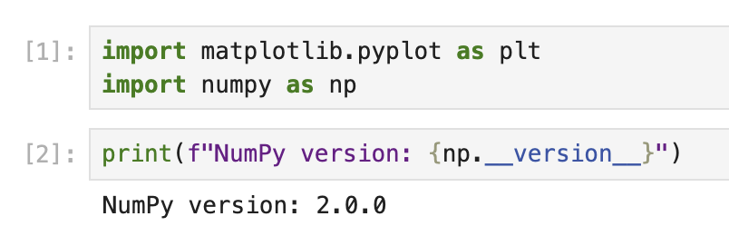

# Understanding Matplotlib and Creating a Notebook

In this first step, we will learn about Matplotlib and create a new Jupyter notebook for our visualization task.

## What is Matplotlib?

Matplotlib is a comprehensive library for creating static, animated, and interactive visualizations in Python. It provides an object-oriented API for embedding plots into applications and is widely used for data visualization by scientists, engineers, and data analysts.

## Create a New Notebook

In the first cell of your notebook, let's import the Matplotlib library. Type the following code and run the cell by pressing Shift+Enter:

```python
import matplotlib.pyplot as plt
import numpy as np

# Check the Matplotlib version
print(f"NumPy version: {np.__version__}")
```



When you run this code, you should see output similar to:

```
NumPy version: 2.0.0
```

The exact version number may vary depending on your environment.

Now we have Matplotlib imported and ready to use. The `plt` is a conventional alias used for the pyplot module, which provides a MATLAB-like interface for creating plots.
