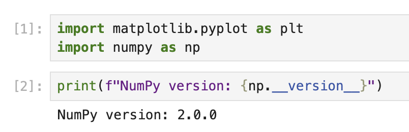

# Matplotlib の理解とノートブックの作成

最初のステップでは、Matplotlib について学び、データ視覚化のタスク用に新しい Jupyter ノートブックを作成します。

## Matplotlib とは何か？

Matplotlib は、Python で静的、アニメーション、インタラクティブな視覚化を作成するための包括的なライブラリです。グラフをアプリケーションに埋め込むためのオブジェクト指向 API を提供し、科学者、エンジニア、データアナリストによってデータ視覚化に広く使用されています。

## 新しいノートブックを作成する

ノートブックの最初のセルで、Matplotlib ライブラリをインポートしましょう。以下のコードを入力し、Shift+Enter を押してセルを実行します。

```python
import matplotlib.pyplot as plt
import numpy as np

# Check the Matplotlib version
print(f"NumPy version: {np.__version__}")
```



このコードを実行すると、以下のような出力が表示されるはずです。

```
NumPy version: 2.0.0
```

正確なバージョン番号は、使用環境によって異なる場合があります。

これで Matplotlib がインポートされ、使用できる状態になりました。`plt` は pyplot モジュールに対する一般的なエイリアスで、グラフを作成するための MATLAB のようなインターフェースを提供します。
