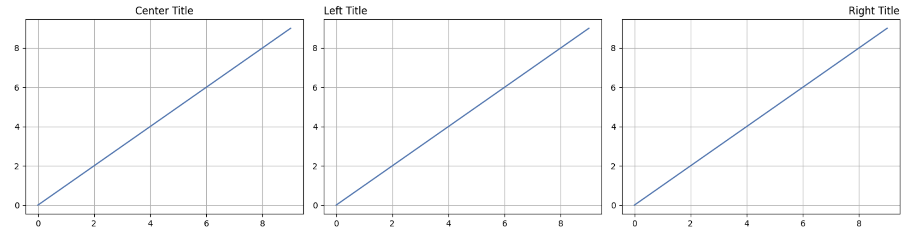

# Positionnement des titres à gauche et à droite

Matplotlib vous permet de positionner le titre à gauche ou à droite du graphique en utilisant le paramètre `loc`. Dans cette étape, vous apprendrez à aligner les titres sur le côté gauche et le côté droit de vos graphiques.

## Création d'un graphique avec un titre aligné à gauche

Créons un graphique avec le titre positionné sur le côté gauche. Dans une nouvelle cellule, entrez le code suivant :

```python
plt.figure(figsize=(8, 5))
plt.plot(range(10))
plt.grid(True)
plt.title('Left-Aligned Title', loc='left')  # Position the title at the left
plt.show()
```


Exécutez la cellule. Remarquez comment le titre apparaît maintenant aligné avec le bord gauche du graphique, plutôt que centré.

Le paramètre `loc` dans la fonction `title()` détermine la position horizontale du titre. En définissant `loc='left'`, vous indiquez à Matplotlib de positionner le titre sur le côté gauche du graphique.

## Création d'un graphique avec un titre aligné à droite

Maintenant, créons un autre graphique avec le titre positionné sur le côté droit. Dans une nouvelle cellule, entrez le code suivant :

```python
plt.figure(figsize=(8, 5))
plt.plot(range(10))
plt.grid(True)
plt.title('Right-Aligned Title', loc='right')  # Position the title at the right
plt.show()
```


Exécutez la cellule. Le titre devrait maintenant apparaître aligné avec le bord droit du graphique.

## Comparaison des différentes positions de titre

Créons une série de trois graphiques pour comparer les différentes positions de titre (centré, à gauche et à droite). Dans une nouvelle cellule, entrez le code suivant :

```python
# Create a figure with 3 subplots arranged horizontally
fig, axes = plt.subplots(1, 3, figsize=(15, 4))

# Plot 1: Center-aligned title (default)
axes[0].plot(range(10))
axes[0].grid(True)
axes[0].set_title('Center Title')

# Plot 2: Left-aligned title
axes[1].plot(range(10))
axes[1].grid(True)
axes[1].set_title('Left Title', loc='left')

# Plot 3: Right-aligned title
axes[2].plot(range(10))
axes[2].grid(True)
axes[2].set_title('Right Title', loc='right')

plt.tight_layout()  # Adjust spacing between subplots
plt.show()
```



Exécutez la cellule pour voir les trois positions de titre côte à côte. Cette comparaison visuelle vous aide à comprendre comment le paramètre `loc` affecte le positionnement du titre.

Notez que lorsque vous travaillez avec des sous - graphiques, nous utilisons la méthode `set_title()` sur les objets d'axe individuels plutôt que la fonction globale `plt.title()`.
