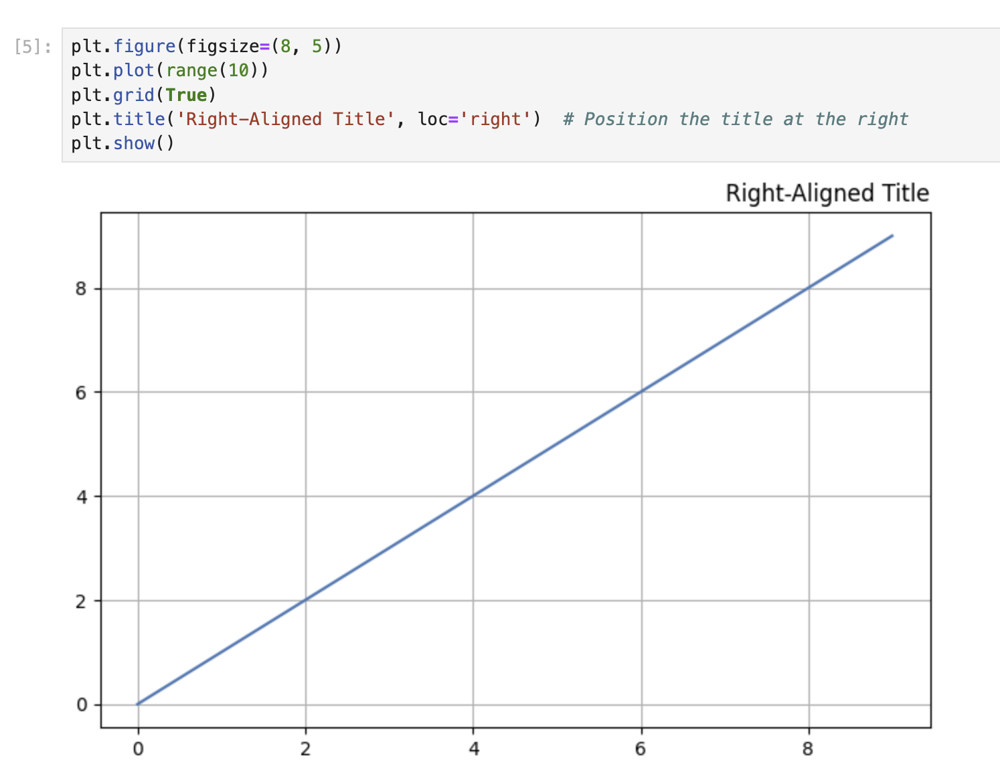

# タイトルの左配置と右配置

Matplotlib では、`loc` パラメータを使用して、タイトルをプロットの左側または右側に配置することができます。このステップでは、プロットの左側と右側にタイトルを配置する方法を学びます。

## 左揃えのタイトルを持つプロットの作成

タイトルを左側に配置したプロットを作成しましょう。新しいセルに以下のコードを入力します。

```python
plt.figure(figsize=(8, 5))
plt.plot(range(10))
plt.grid(True)
plt.title('Left-Aligned Title', loc='left')  # Position the title at the left
plt.show()
```


セルを実行します。タイトルが中央ではなく、プロットの左側に配置されていることに注意してください。

`title()` 関数の `loc` パラメータは、タイトルの水平位置を決定します。`loc='left'` を設定することで、Matplotlib にタイトルをプロットの左側に配置するよう指示しています。

## 右揃えのタイトルを持つプロットの作成

では、タイトルを右側に配置した別のプロットを作成しましょう。新しいセルに以下のコードを入力します。

```python
plt.figure(figsize=(8, 5))
plt.plot(range(10))
plt.grid(True)
plt.title('Right-Aligned Title', loc='right')  # Position the title at the right
plt.show()
```



セルを実行します。タイトルはプロットの右側に配置されるはずです。

## 異なるタイトル位置の比較

異なるタイトル位置（中央、左、右）を比較するために、3 つのプロットのシーケンスを作成しましょう。新しいセルに以下のコードを入力します。

```python
# Create a figure with 3 subplots arranged horizontally
fig, axes = plt.subplots(1, 3, figsize=(15, 4))

# Plot 1: Center-aligned title (default)
axes[0].plot(range(10))
axes[0].grid(True)
axes[0].set_title('Center Title')

# Plot 2: Left-aligned title
axes[1].plot(range(10))
axes[1].grid(True)
axes[1].set_title('Left Title', loc='left')

# Plot 3: Right-aligned title
axes[2].plot(range(10))
axes[2].grid(True)
axes[2].set_title('Right Title', loc='right')

plt.tight_layout()  # Adjust spacing between subplots
plt.show()
```


セルを実行して、3 つのタイトル位置を並べて表示します。この視覚的な比較により、`loc` パラメータがタイトルの配置にどのように影響するかを理解することができます。

サブプロットを使用する場合は、グローバルな `plt.title()` 関数ではなく、個々の軸オブジェクトに対して `set_title()` メソッドを使用することに注意してください。
