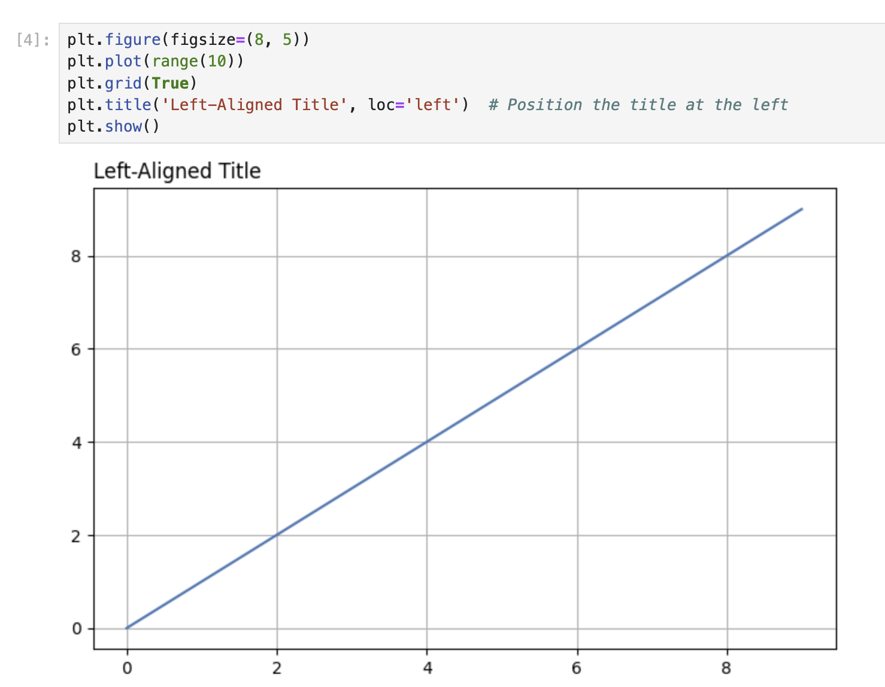
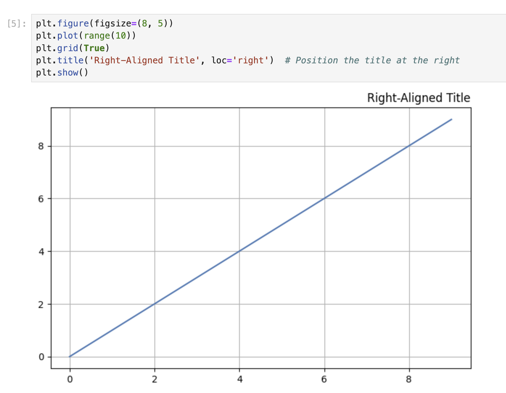
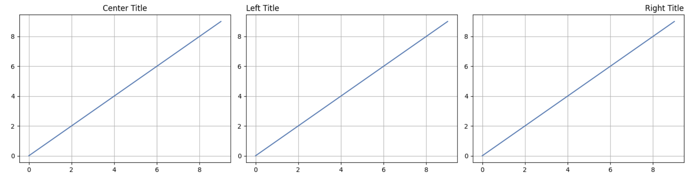

# Posicionamento de Títulos à Esquerda e à Direita

Matplotlib permite que você posicione o título no lado esquerdo ou direito do gráfico usando o parâmetro `loc`. Nesta etapa, você aprenderá como alinhar títulos aos lados esquerdo e direito de seus gráficos.

## Criando um Gráfico com um Título Alinhado à Esquerda

Vamos criar um gráfico com o título posicionado no lado esquerdo. Em uma nova célula, insira o seguinte código:

```python
plt.figure(figsize=(8, 5))
plt.plot(range(10))
plt.grid(True)
plt.title('Left-Aligned Title', loc='left')  # Position the title at the left
plt.show()
```



Execute a célula. Observe como o título agora aparece alinhado com a borda esquerda do gráfico, em vez de centralizado.

O parâmetro `loc` na função `title()` determina a posição horizontal do título. Ao definir `loc='left'`, você está dizendo ao Matplotlib para posicionar o título no lado esquerdo do gráfico.

## Criando um Gráfico com um Título Alinhado à Direita

Agora, vamos criar outro gráfico com o título posicionado no lado direito. Em uma nova célula, insira o seguinte código:

```python
plt.figure(figsize=(8, 5))
plt.plot(range(10))
plt.grid(True)
plt.title('Right-Aligned Title', loc='right')  # Position the title at the right
plt.show()
```



Execute a célula. O título agora deve aparecer alinhado com a borda direita do gráfico.

## Comparando Diferentes Posições de Título

Vamos criar uma sequência de três gráficos para comparar as diferentes posições do título (centro, esquerda e direita). Em uma nova célula, insira o seguinte código:

```python
# Create a figure with 3 subplots arranged horizontally
fig, axes = plt.subplots(1, 3, figsize=(15, 4))

# Plot 1: Center-aligned title (default)
axes[0].plot(range(10))
axes[0].grid(True)
axes[0].set_title('Center Title')

# Plot 2: Left-aligned title
axes[1].plot(range(10))
axes[1].grid(True)
axes[1].set_title('Left Title', loc='left')

# Plot 3: Right-aligned title
axes[2].plot(range(10))
axes[2].grid(True)
axes[2].set_title('Right Title', loc='right')

plt.tight_layout()  # Adjust spacing between subplots
plt.show()
```



Execute a célula para ver todas as três posições do título lado a lado. Essa comparação visual ajuda você a entender como o parâmetro `loc` afeta o posicionamento do título.

Observe que, ao trabalhar com subplots, usamos o método `set_title()` nos objetos de eixo individuais, em vez da função global `plt.title()`.
