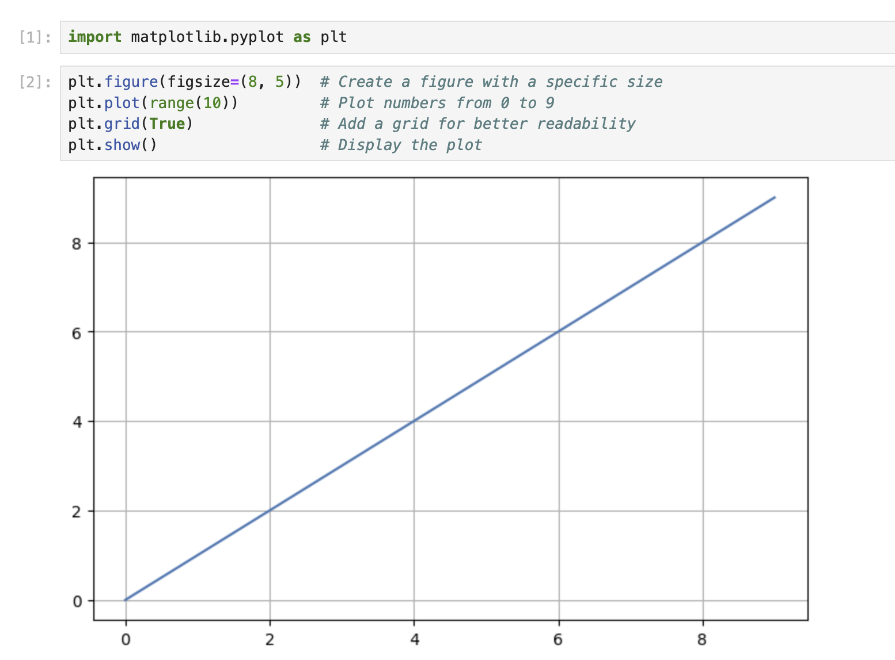
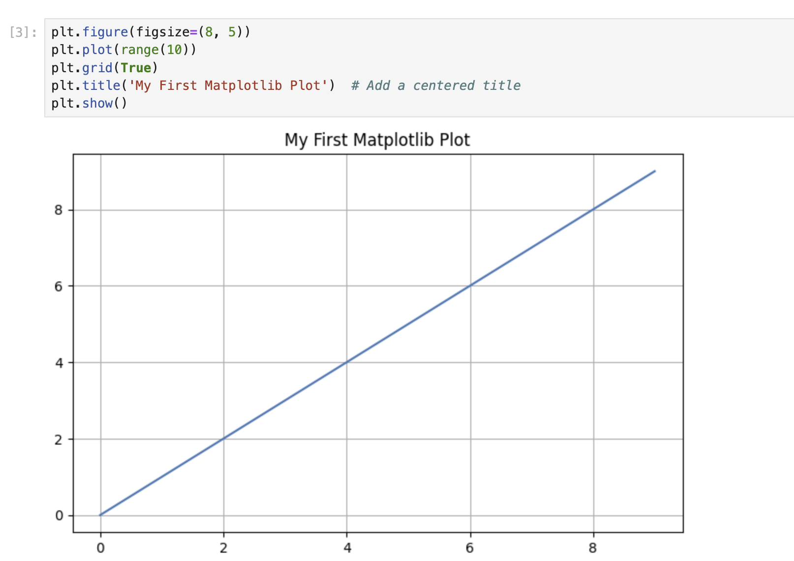

# Базовое построение графиков с заголовком в позиции по умолчанию

На этом этапе вы создадите простой линейный график и добавите заголовок, выровненный по центру, что является позицией по умолчанию в Matplotlib.

## Создание Jupyter Notebook

После завершения запуска виртуальной машины (VM) нажмите в левом верхнем углу, чтобы переключиться на вкладку **Notebook** и получить доступ к Jupyter Notebook.


Вам может потребоваться подождать несколько секунд, пока Jupyter Notebook загрузится. Из-за ограничений Jupyter Notebook автоматизация проверки операций невозможна.

Если вы столкнетесь с какими-либо проблемами во время практического занятия, не стесняйтесь обращаться за помощью к Labby. Пожалуйста, дайте обратную связь после завершения сессии, чтобы мы могли оперативно решить любые проблемы.

## Импорт Matplotlib

Теперь начнем с импорта библиотеки Matplotlib. В первой ячейке вашего блокнота введите следующий код и запустите его, нажав Shift+Enter:

```python
import matplotlib.pyplot as plt
```

Этот код импортирует модуль pyplot из Matplotlib и присваивает ему псевдоним `plt`, что является распространенной практикой.

## Создание простого графика

Далее создадим базовый линейный график. В новой ячейке введите следующий код и запустите его:

```python
plt.figure(figsize=(8, 5))  # Create a figure with a specific size
plt.plot(range(10))         # Plot numbers from 0 to 9
plt.grid(True)              # Add a grid for better readability
plt.show()                  # Display the plot
```

В выходных данных вы должны увидеть простой линейный график с значениями от 0 до 9.



## Добавление заголовка по умолчанию (выровненного по центру)

Теперь добавим заголовок к нашему графику. По умолчанию заголовок выравнивается по центру верхней части графика. В новой ячейке введите следующий код:

```python
plt.figure(figsize=(8, 5))
plt.plot(range(10))
plt.grid(True)
plt.title('My First Matplotlib Plot')  # Add a centered title
plt.show()
```



Запустите ячейку, и вы должны увидеть график с заголовком, выровненным по центру сверху.

Функция `title()` без дополнительных параметров поместит заголовок в центр, что является позицией по умолчанию.
