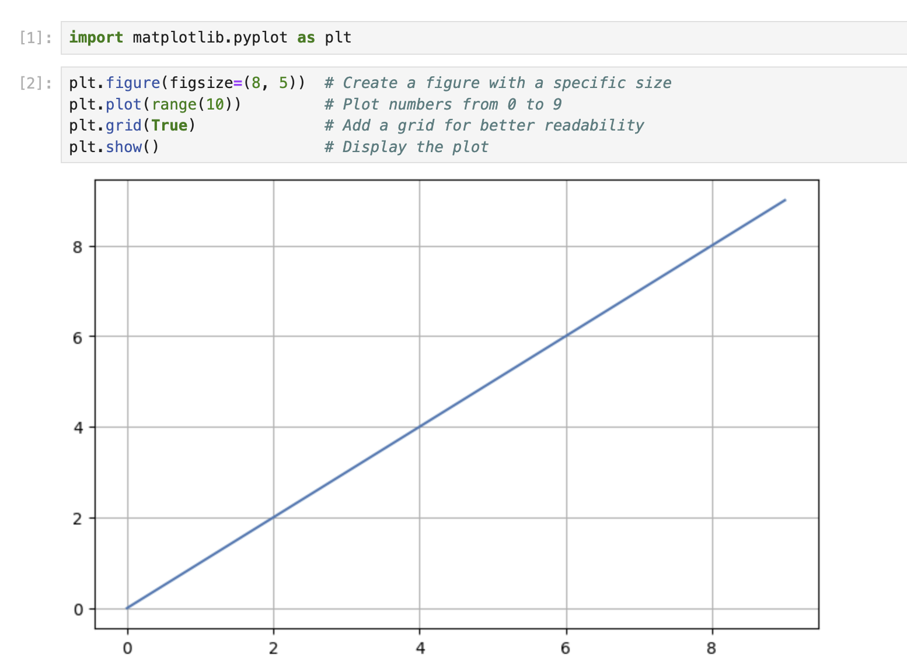

# 使用默认标题位置进行基本绘图

在这一步中，你将创建一个简单的折线图并添加一个居中的标题，这是 Matplotlib 中的默认位置。

## 创建 Jupyter Notebook

虚拟机启动完成后，点击左上角切换到 **Notebook** 标签页以访问 Jupyter Notebook。


你可能需要等待几秒钟，让 Jupyter Notebook 加载完成。由于 Jupyter Notebook 的限制，操作验证无法自动进行。

如果你在实验过程中遇到任何问题，随时向 Labby 寻求帮助。请在实验结束后提供反馈，以便我们及时解决任何问题。

## 导入 Matplotlib

现在，让我们从导入 Matplotlib 库开始。在你的 Notebook 的第一个单元格中，输入以下代码并按 Shift+Enter 运行：

```python
import matplotlib.pyplot as plt
```

这行代码从 Matplotlib 中导入了 pyplot 模块，并将其别名为 `plt`，这是一种常见的约定。

## 创建简单的图表

接下来，让我们创建一个基本的折线图。在一个新的单元格中，输入以下代码并运行：

```python
plt.figure(figsize=(8, 5))  # Create a figure with a specific size
plt.plot(range(10))         # Plot numbers from 0 to 9
plt.grid(True)              # Add a grid for better readability
plt.show()                  # Display the plot
```

你应该会在输出中看到一个简单的折线图，显示从 0 到 9 的数值。



## 添加默认（居中）标题

现在，让我们为图表添加一个标题。标题的默认位置是在图表顶部居中。在一个新的单元格中，输入以下代码：

```python
plt.figure(figsize=(8, 5))
plt.plot(range(10))
plt.grid(True)
plt.title('My First Matplotlib Plot')  # Add a centered title
plt.show()
```


运行该单元格，你应该会看到图表顶部有一个居中的标题。

`title()` 函数在不使用任何额外参数的情况下会将标题置于中心位置，这是默认设置。
