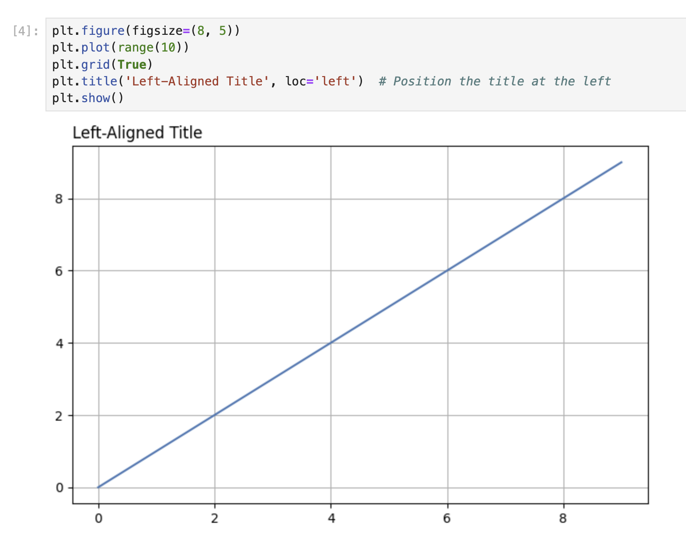

# 标题左对齐和右对齐

Matplotlib 允许你使用 `loc` 参数将标题定位在图表的左侧或右侧。在这一步中，你将学习如何将标题对齐到图表的左侧和右侧。

## 创建标题左对齐的图表

让我们创建一个标题位于左侧的图表。在一个新的单元格中，输入以下代码：

```python
plt.figure(figsize=(8, 5))
plt.plot(range(10))
plt.grid(True)
plt.title('Left-Aligned Title', loc='left')  # Position the title at the left
plt.show()
```



运行该单元格。注意，现在标题是与图表的左边缘对齐，而不是居中显示。

`title()` 函数中的 `loc` 参数决定了标题的水平位置。通过设置 `loc='left'`，你是在告诉 Matplotlib 将标题定位在图表的左侧。

## 创建标题右对齐的图表

现在，让我们创建另一个标题位于右侧的图表。在一个新的单元格中，输入以下代码：

```python
plt.figure(figsize=(8, 5))
plt.plot(range(10))
plt.grid(True)
plt.title('Right-Aligned Title', loc='right')  # Position the title at the right
plt.show()
```


运行该单元格。标题现在应该与图表的右边缘对齐。

## 比较不同的标题位置

让我们创建一组三个图表，以比较不同的标题位置（居中、左对齐和右对齐）。在一个新的单元格中，输入以下代码：

```python
# Create a figure with 3 subplots arranged horizontally
fig, axes = plt.subplots(1, 3, figsize=(15, 4))

# Plot 1: Center-aligned title (default)
axes[0].plot(range(10))
axes[0].grid(True)
axes[0].set_title('Center Title')

# Plot 2: Left-aligned title
axes[1].plot(range(10))
axes[1].grid(True)
axes[1].set_title('Left Title', loc='left')

# Plot 3: Right-aligned title
axes[2].plot(range(10))
axes[2].grid(True)
axes[2].set_title('Right Title', loc='right')

plt.tight_layout()  # Adjust spacing between subplots
plt.show()
```


运行该单元格，你将看到三种标题位置并排显示。这种可视化比较有助于你理解 `loc` 参数是如何影响标题位置的。

请注意，在处理子图时，我们使用单个轴对象的 `set_title()` 方法，而不是全局的 `plt.title()` 函数。
