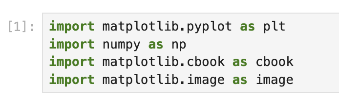

# Erstellen eines Jupyter Notebooks und Importieren der erforderlichen Bibliotheken

Geben Sie in der ersten Zelle Ihres Notebooks den folgenden Code ein, um die erforderlichen Bibliotheken zu importieren:

```python
import matplotlib.pyplot as plt
import numpy as np
import matplotlib.cbook as cbook
import matplotlib.image as image
```

Lassen Sie uns verstehen, was jede dieser Bibliotheken tut:

- `matplotlib.pyplot` (Alias `plt`): Eine Sammlung von Funktionen, die matplotlib wie MATLAB funktionieren lassen und eine bequeme Schnittstelle zum Erstellen von Diagrammen bieten.
- `numpy` (Alias `np`): Ein grundlegendes Paket für wissenschaftliche Berechnungen in Python, das wir zur Datenmanipulation verwenden werden.
- `matplotlib.cbook`: Eine Sammlung von Hilfsfunktionen für matplotlib, einschließlich Funktionen zum Abrufen von Beispieldaten.
- `matplotlib.image`: Ein Modul für bildbezogene Funktionen in matplotlib, das wir zum Lesen und Anzeigen von Bildern verwenden werden.

Führen Sie die Zelle aus, indem Sie auf die Schaltfläche "Run" oben im Notebook klicken oder Shift+Enter drücken.



Die Ausführung dieser Zelle sollte ohne Ausgabe abgeschlossen werden, was darauf hinweist, dass alle Bibliotheken erfolgreich importiert wurden.
