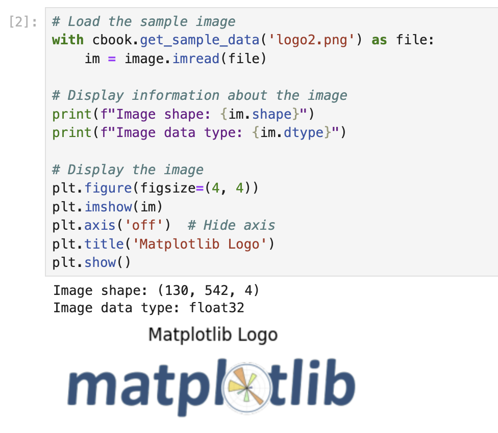

# 画像の読み込みと確認

これでライブラリをインポートしたので、グラフ上に重ねる画像を読み込む必要があります。Matplotlib は練習用のサンプル画像をいくつか提供しています。

1. Notebook で新しいセルを作成し、以下のコードを入力します。

```python
# Load the sample image
with cbook.get_sample_data('logo2.png') as file:
    im = image.imread(file)

# Display information about the image
print(f"Image shape: {im.shape}")
print(f"Image data type: {im.dtype}")

# Display the image
plt.figure(figsize=(4, 4))
plt.imshow(im)
plt.axis('off')  # Hide axis
plt.title('Matplotlib Logo')
plt.show()
```

このコードは以下のことを行います。

- `cbook.get_sample_data()` を使用して、Matplotlib のサンプルデータコレクションから 'logo2.png' という名前のサンプル画像を読み込みます。
- `image.imread()` を使用して、画像ファイルを NumPy 配列として読み込みます。
- 画像の次元とデータ型に関する情報を出力します。
- `plt.imshow()` を使用して画像を表示するための図を作成します。
- `plt.axis('off')` で軸の目盛りとラベルを非表示にします。
- 図にタイトルを追加します。
- `plt.show()` を使用して図を表示します。

2. Shift + Enter を押してセルを実行します。

出力には画像に関する情報が表示され、Matplotlib のロゴが表示されるはずです。画像の形状は画像の次元（高さ、幅、色チャンネル）を示し、データ型は画像データの保存形式を示します。



このステップは、オーバーレイとして使用する画像を理解するのに役立つため重要です。画像の外観と寸法を確認でき、グラフ上に配置する方法を決める際に役立ちます。
