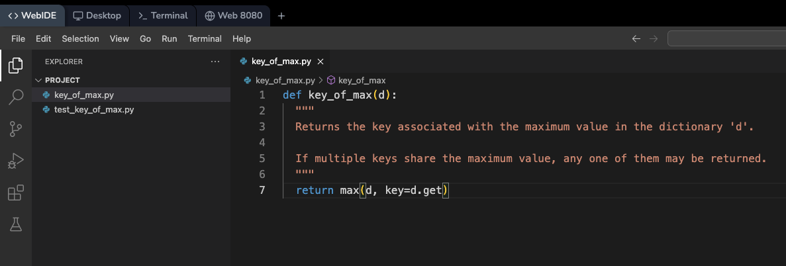

# 创建基本函数

让我们从创建函数的核心部分开始。我们将逐步构建它。首先，创建一个名为 `key_of_max.py` 的文件。你可以使用内置的 LabEx 代码编辑器，或者像 `nano` 或 `vim` 这样的基于终端的编辑器。在 `key_of_max.py` 中，添加以下代码：



```python
def key_of_max(d):
  """
  返回字典 'd' 中与最大值关联的键。

  如果多个键具有相同的最大值，则可以返回其中任何一个。
  """
  return max(d, key=d.get)
```

以下是代码的详细解释：

- **`def key_of_max(d):`**：这行代码定义了一个名为 `key_of_max` 的函数。它接受一个参数 `d`，代表我们要处理的字典。
- **`return max(d, key=d.get)`**：这是函数的核心部分。让我们逐步分析它：
  - **`max(d,...)`**：内置的 `max()` 函数用于找出最大的元素。默认情况下，如果你将一个字典传递给 `max()`，它会找出最大的 _键_（按字母顺序）。但我们不需要这样，我们想要的是与最大 _值_ 相关联的 _键_。
  - **`key=d.get`**：这是关键部分。`key` 参数告诉 `max()` 如何比较元素。`d.get` 是字典的一个方法。当你调用 `d.get(some_key)` 时，它会返回与 `some_key` 关联的 _值_。通过设置 `key=d.get`，我们告诉 `max()`：“使用字典 `d` 中元素的 _值_ 来比较它们，而不是使用它们的键。”然后，`max()` 函数会返回对应于该最大值的 _键_。
