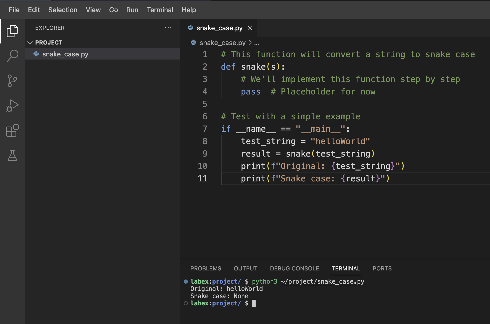

# Das Problem verstehen

Bevor wir unsere Funktion zur Umwandlung in Snake Case schreiben, verstehen wir zunächst, was wir erreichen müssen:

1. Wir müssen eine Zeichenkette (String) aus einem beliebigen Format in Snake Case umwandeln.
2. Snake Case bedeutet, dass alle Buchstaben klein geschrieben sind und die Wörter durch Unterstriche getrennt werden.
3. Wir müssen verschiedene Eingabeformate verarbeiten:
   - camelCase (z.B. `camelCase` → `camel_case`)
   - Zeichenketten mit Leerzeichen (z.B. `some text` → `some_text`)
   - Zeichenketten mit gemischtem Format (z.B. Bindestriche, Unterstriche und gemischte Groß - und Kleinschreibung)

Beginnen wir damit, eine neue Python - Datei für unsere Snake - Case - Funktion zu erstellen. Im WebIDE navigieren Sie zum Projektverzeichnis und erstellen Sie eine neue Datei namens `snake_case.py`:

```python
# This function will convert a string to snake case
def snake(s):
    # We'll implement this function step by step
    pass  # Placeholder for now

# Test with a simple example
if __name__ == "__main__":
    test_string = "helloWorld"
    result = snake(test_string)
    print(f"Original: {test_string}")
    print(f"Snake case: {result}")
```

Speichern Sie diese Datei. Im nächsten Schritt werden wir mit der Implementierung der Funktion beginnen.

Lassen Sie uns zunächst unsere Platzhalterfunktion ausführen, um sicherzustellen, dass unsere Datei korrekt eingerichtet ist. Öffnen Sie ein Terminal und führen Sie aus:

```bash
python3 ~/project/snake_case.py
```



Sie sollten eine Ausgabe wie die folgende sehen:

```
Original: helloWorld
Snake case: None
```

Das Ergebnis ist `None`, weil unsere Funktion derzeit nur den Standard - Python - Wert `None` zurückgibt. Im nächsten Schritt werden wir die eigentliche Umwandlungslogik hinzufügen.
