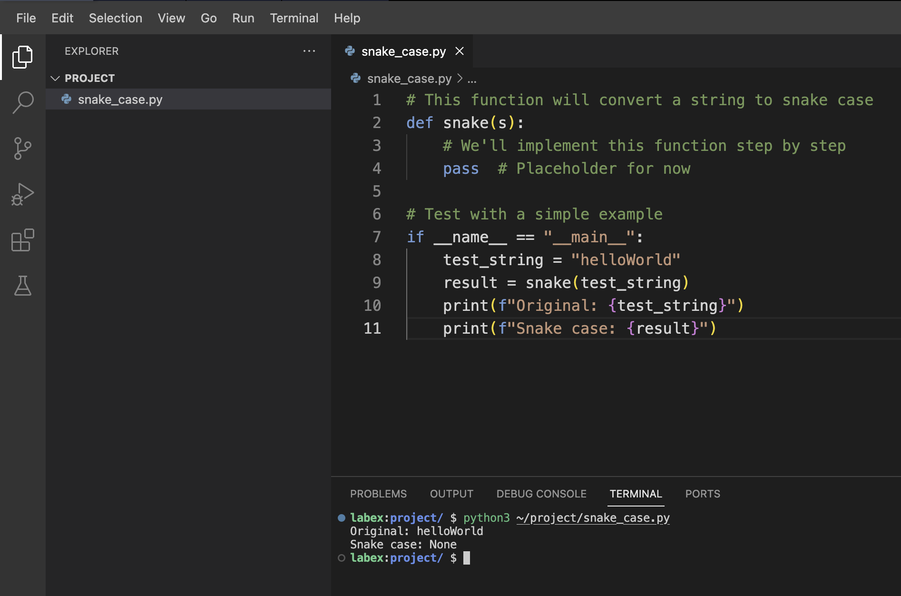

# 問題の理解

スネークケースへの変換関数を書く前に、達成すべきことを理解しましょう。

1. 任意の形式の文字列をスネークケースに変換する必要があります。
2. スネークケースとは、単語間にアンダースコアがあり、すべて小文字の形式です。
3. 異なる入力形式を扱う必要があります。
   - キャメルケース（camelCase）（例: `camelCase` → `camel_case`）
   - 空白を含む文字列（例: `some text` → `some_text`）
   - 混合形式（ハイフン、アンダースコア、大文字小文字の混合など）の文字列

スネークケース関数用の新しいPythonファイルを作成しましょう。WebIDEでプロジェクトディレクトリに移動し、`snake_case.py` という名前の新しいファイルを作成します。

```python
# This function will convert a string to snake case
def snake(s):
    # We'll implement this function step by step
    pass  # Placeholder for now

# Test with a simple example
if __name__ == "__main__":
    test_string = "helloWorld"
    result = snake(test_string)
    print(f"Original: {test_string}")
    print(f"Snake case: {result}")
```

このファイルを保存します。次のステップで、関数の実装を始めます。

現時点では、ファイルが正しく設定されていることを確認するために、プレースホルダー関数を実行しましょう。ターミナルを開き、次のコマンドを実行します。

```bash
python3 ~/project/snake_case.py
```



次のような出力が表示されるはずです。

```
Original: helloWorld
Snake case: None
```

結果が `None` となっているのは、現在の関数がデフォルトのPythonの `None` 値を返しているだけだからです。次のステップで、実際の変換ロジックを追加します。
