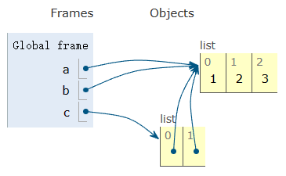

# Ejemplo de asignación

Considere este fragmento de código.

```python
a = [1,2,3]
b = a
c = [a,b]
```

Una representación de las operaciones de memoria subyacentes. En este ejemplo, solo hay un objeto lista `[1,2,3]`, pero hay cuatro referencias diferentes a él.



Esto significa que modificar un valor afecta a _todas_ las referencias.

```python
>>> a.append(999)
>>> a
[1,2,3,999]
>>> b
[1,2,3,999]
>>> c
[[1,2,3,999], [1,2,3,999]]
>>>
```

Observe cómo un cambio en la lista original se refleja en todos los demás lugares (ay!). Esto se debe a que nunca se hicieron copias. Todo apunta a lo mismo.
