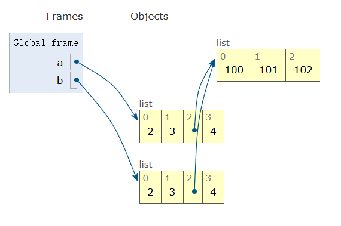

# 浅拷贝

列表和字典有用于复制的方法。

```python
>>> a = [2,3,[100,101],4]
>>> b = list(a) # 进行复制
>>> a is b
False
```

这是一个新的列表，但列表中的元素是共享的。

```python
>>> a[2].append(102)
>>> b[2]
[100,101,102]
>>>
>>> a[2] is b[2]
True
>>>
```

例如，内部列表 `[100, 101, 102]` 是共享的。这就是所谓的浅拷贝。下面是一张示意图。


