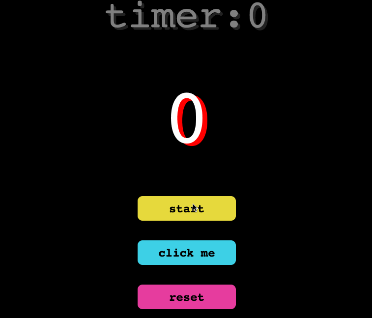

# カウンターゲーム

始めるには、エディタを開きます。エディタから以下のファイルが見えます。

```txt
├── public
├── src
│   ├── components
│   │  └── HomePage
│   │       ├── HomePage.css
│   │       └── HomePage.js
│   ├── App.js
│   ├── index.css
│   └── index.js
├── package-lock.json
└── package.json
```

## 要件

- プロジェクトの依存関係をインストールするには、以下のコマンドを使用します。

  ```bash
  npm i
  ```

- このチャレンジは、`components/HomePage/HomePage.js` ファイルで完了してください。
- `useState` フックを使用して、2つの状態変数 `count` と `timer` を定義します。
- `useEffect` フックを使用して、タイマーの状態変数が変更されたときにタイマーを開始します。
- `timer` の値を確認します。ゼロの場合、エフェクトは早期に返され、何も行いません。
- `timer` の値がゼロでない場合、1秒ごと（1000ミリ秒）に `timer` の値を1減らすインターバルを設定します。
- コンポーネントがアンマウントされるとき、またはタイマーの値が変更されるときにインターバルを解除するクリーンアップ関数を返します。

## 例

コードを完成させたら、以下のコマンドで実行します。

```bash
npm start
```

完成した結果は以下の通りです。


