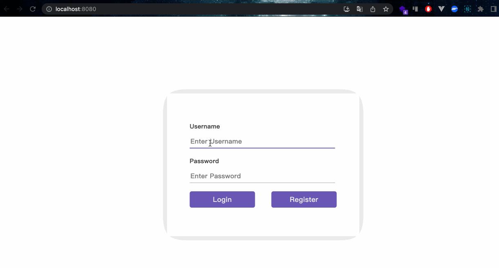

# 自定义表单

首先，打开编辑器。在编辑器中你可以看到以下文件。

```txt
├── public
├── src
│   ├── components
│   │   └── CustomForm
│   │       ├── CustomForm.css
│   │       └── CustomForm.js
│   ├── App.js
│   ├── index.css
│   └── index.js
├── package-lock.json
└── package.json
```

## 要求

- 要安装项目依赖项，请使用以下命令：

  ```bash
  npm i
  ```

- 请在 `App.js` 文件中完成此挑战。
- 使用 `useRef` 钩子创建两个引用对象，`usernameRef` 和 `passwordRef`。这些引用将用于访问输入字段的值。
- `handleLogin` 函数：当点击“登录”按钮时调用此函数。它会将用户名和密码输入字段的值记录到控制台，并显示一个包含输入的用户名和密码的警报。
- `handleRegister` 函数：当点击“注册”按钮时调用此函数。它会将用户名和密码输入字段的值记录到控制台。

## 示例

完成代码后，使用以下命令运行它：

```bash
npm start
```

最终结果如下：


