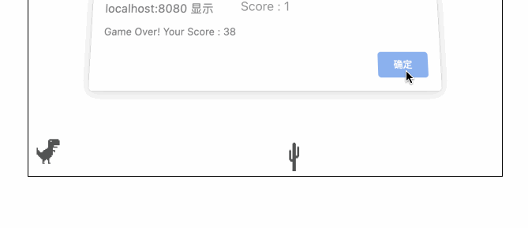

# Dino Game

To get started, open the editor. You can see the following files from your editor.

```txt
├── public
├── src
│   ├──components
│   │  └── Dino
│   │       ├── img
│   │       │   ├── cactus.png
│   │       │   └── trex.png
│   │       ├── Dino.css
│   │       └── Dino.js
│   ├── App.js
│   ├── App.css
│   ├── index.css
│   └── index.js
├── package-lock.json
└── package.json
```

## Requirements

- To install the project dependencies, use the following command:

  ```bash
  npm i
  ```

- Please complete this challenge in the `src/components/Dino/Dino.js` file.
- Initialize two `useRef` hooks: `dinoRef` and `cactusRef`. These hooks will be used to reference the dinosaur and cactus DOM elements.
- Initialize a `useState` hook called score with an initial value of 0. This hook will keep track of the player's score.
- Define the jump function. It adds the class "jump" to the dinosaur's DOM element referenced by dinoRef. This triggers a CSS animation that makes the dinosaur jump. After a timeout of 300 milliseconds, the "jump" class is removed, bringing the dinosaur back to its original position.
- Use the `useEffect` hook to handle the game logic. It sets up an interval that runs every 10 milliseconds. Inside the interval function, it retrieves the current position of the dinosaur (dinoTop) and the cactus (cactusLeft) using the getComputedStyle function.
- It checks if a collision has occurred by comparing the cactus position (cactusLeft) with the dinosaur's position (dinoTop). If the cactus is within a certain range and at the same height as the dinosaur, a collision is detected. In this case, an alert is shown with the player's score, and the score is reset to 0 using the setScore function. Otherwise, the score is incremented by 1 using setScore.
- The first `useEffect` hook also returns a cleanup function that clears the interval when the component unmounts. This ensures that the interval is properly cleaned up to avoid memory leaks.
- The second `useEffect` hook is responsible for setting up and removing an event listener for the "keydown" event. When a key is pressed, the jump function is called. This allows the player to make the dinosaur jump by pressing any key.

## Example

Once you have completed the code, run it with the following command:

```bash
npm start
```

The finished result is as follows:


