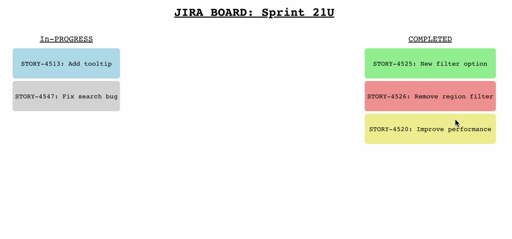

# Перетаскивание элементов

Для начала работы откройте редактор. В редакторе вы можете увидеть следующие файлы.

```txt
├── public
├── src
│   ├── App.js
│   ├── App.css
│   ├── index.css
│   └── index.js
├── package-lock.json
└── package.json
```

## Требования

- Чтобы установить зависимости проекта, используйте следующую команду:

  ```bash
  npm i
  ```

- Пожалуйста, завершите это задание в файле `App.js`.
- Функция `onDragStart` определена. Это обработчик события dragstart для карточки задачи. Она устанавливает данные передачи данных в свойство имени задачи, которое будет использоваться для идентификации задачи при ее сбросе.
- Функция `onDrop` определена. Это обработчик события drop для доски задач. Она извлекает имя задачи из данных передачи данных, обновляет категорию задачи в состоянии задач в зависимости от места сброса (cat) и устанавливает обновленное состояние задач с использованием setTasks.

## Пример

После завершения кода запустите его с помощью следующей команды:

```bash
npm start
```

Готовый результат выглядит так:


