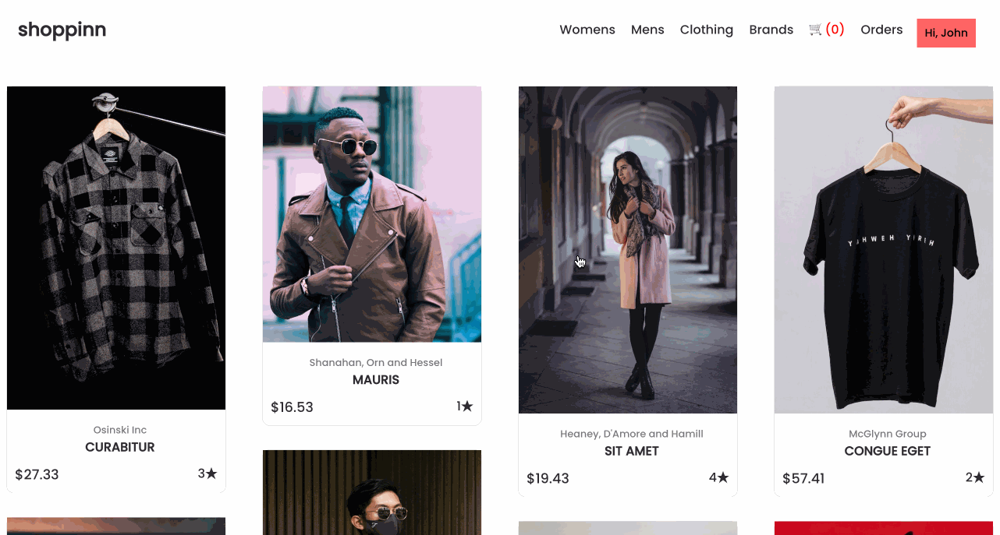

# Ecommerce Website

To get started, open the editor. You can see the following files from your editor.

```txt
├── public
├── src
│   ├── components
│   ├── context
│   ├── mockData
│   ├── App.css
│   ├── App.js
│   ├── index.css
│   └── index.js
├── package-lock.json
└── package.json
```

## Requirements

- To install the project dependencies, use the following command:

  ```bash
  npm i
  ```

- Please complete this challenge in the `src/components/itemDetail/ItemDetail.js` file.
- The `getItemDetail` function is defined. It takes an id parameter and returns the item object from the items array that matches the given id.
- Implementation of the ability to click on a product to display the product detail page.

## Example

Once you have completed the code, run it with the following command: 

```bash
npm start
```

The finished result is as follows:


