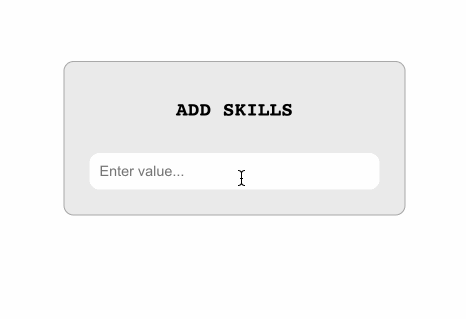

# Entrada de Habilidades

Para comenzar, abra el editor. Puede ver los siguientes archivos desde su editor.

```txt
├── public
├── src
│   ├── components
│   │   └── TagInput.js
│   ├── App.css
│   ├── App.js
│   ├── index.css
│   └── index.js
├── package-lock.json
└── package.json
```

## Requisitos

- Para instalar las dependencias del proyecto, use el siguiente comando:

  ```bash
  npm i
  ```

- Por favor, complete este desafío en el archivo `src/component/TagInput.js`.
- La función `handleAddTag` se llama cuando se presiona una tecla en el campo de entrada. Si la tecla no es la tecla Enter, la función devuelve temprano y no hace nada. De lo contrario, verifica el valor de entrada y lo agrega al estado de las etiquetas si no está vacío y no ha sido agregado previamente. Luego, limpia el campo de entrada.
- La función `onDeleteTag` se llama cuando se hace clic en una etiqueta. Filtra el estado de las etiquetas para eliminar la etiqueta clicada y actualiza el estado con las etiquetas filtradas.

## Ejemplo

Una vez que haya completado el código, ejecútelo con el siguiente comando:

```bash
npm start
```

El resultado final es el siguiente:


