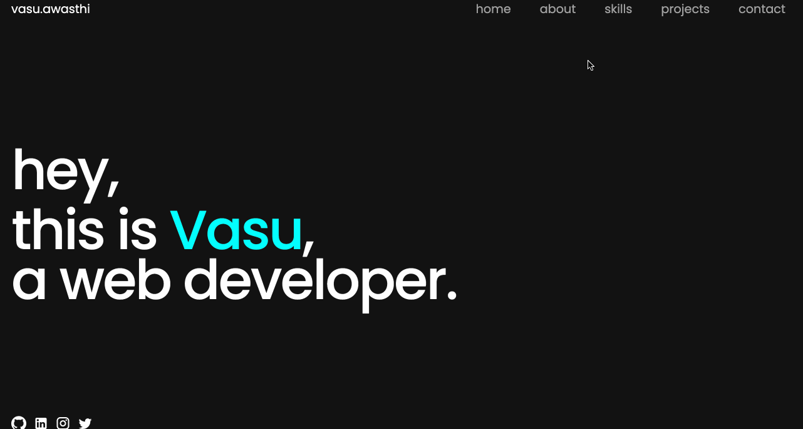

# Персональный портфолио

Для начала работы откройте редактор. Вы можете увидеть следующие файлы в редакторе.

```txt
├── public
├── src
│   ├── components
│   ├── App.css
│   ├── App.js
│   ├── index.css
│   └── index.js
├── package-lock.json
└── package.json
```

## Требования

- Чтобы установить зависимости проекта, используйте следующую команду:

  ```bash
  npm i
  ```

- Пожалуйста, завершите это задание в файле `src/App.js`.
- Функция `toggleVisible` определена для проверки позиции прокрутки и обновления состояния showBackToTopBtn в соответствии с ней.
- Хуки `useEffect` используются для добавления слушателя событий к событию прокрутки окна, которое запускает функцию toggleVisible.
- Функция `scrollToTop` определена для прокрутки окна вверх при нажатии на кнопку «наверх».

## Пример

После завершения кода запустите его с помощью следующей команды:

```bash
npm start
```

Готовый результат выглядит так:


