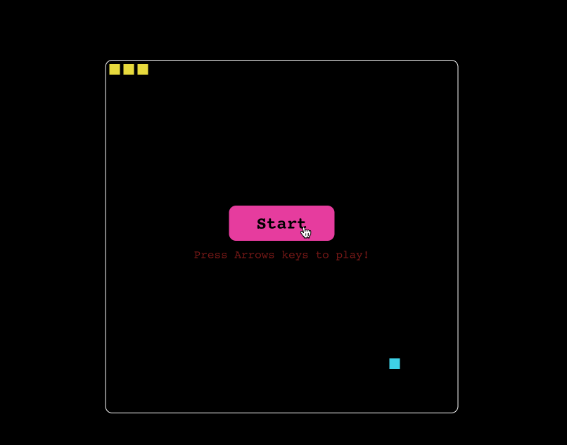

# Snake Game

Pour commencer, ouvrez l'éditeur. Vous pouvez voir les fichiers suivants dans votre éditeur.

```txt
├── public
├── src
│   ├── components
│   │   ├── Food.js
│   │   └── Snake.js
│   ├── App.css
│   ├── App.js
│   ├── index.css
│   └── index.js
├── package-lock.json
└── package.json
```

## Exigences

- Pour installer les dépendances du projet, utilisez la commande suivante :

  ```bash
  npm i
  ```

- Veuillez compléter ce défi dans le fichier `src/App.js`.
- La fonction `randomFoodPosition` est définie pour générer une position aléatoire pour l'élément de nourriture sur le plateau de jeu.
- À l'intérieur de la fonction App, plusieurs variables d'état sont définies en utilisant le hook useState :
  - `snake` représente l'état actuel du serpent.
  - `lastDirection` représente la dernière direction dans laquelle le serpent s'est déplacé.
  - `foodPosition` représente la position actuelle de l'élément de nourriture.
  - `isStarted` détermine si le jeu a commencé.
  - `gameOver` indique si le jeu est terminé.
  - `playgroundRef` est une référence à l'élément du plateau de jeu.

## Exemple

Une fois que vous avez terminé le code, exécutez-le avec la commande suivante :

```bash
npm start
```

Le résultat final est le suivant :


