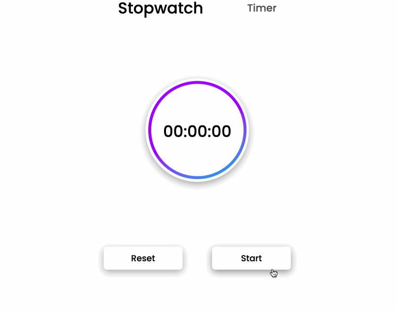

# ストップウォッチ

始めるには、エディタを開きます。エディタから以下のファイルが見えます。

```txt
├── public
├── src
│   ├── components
│   │   ├──common
│   │   ├── stopwatch
│   │   ├── timer
│   │   ├── App.css
│   │   └── App.js
│   ├── index.css
│   └── index.js
├── package-lock.json
└── package.json
```

## 要件

- プロジェクトの依存関係をインストールするには、次のコマンドを使用します。

  ```bash
  npm i
  ```

- このチャレンジは、`src/components/timer/Timer.js` ファイルで完了してください。
- `onStart` 関数は、useEffectフックによって1秒ごとに呼び出されます。
  - タイマーが0時間、0分、0秒に達したかどうかを確認します。その場合は、isStartedをfalseに設定して返します。
  - タイマーが起動していない場合は、何も変更せずに返します。
  - タイマーが動作している場合は、タイマーを1秒減らします。
  - 分または秒が0に達した場合は、setTimer関数を使用して、時間、分、または秒を適切に調整します。
- `onReset` 関数は、「リセット」ボタンがクリックされたときに呼び出されます。
  - isStartedをfalseに設定し、タイマーを0時間、0分、0秒にリセットします。

## 例

コードを完成させたら、次のコマンドで実行します。

```bash
npm start
```

完成した結果は次のとおりです。


