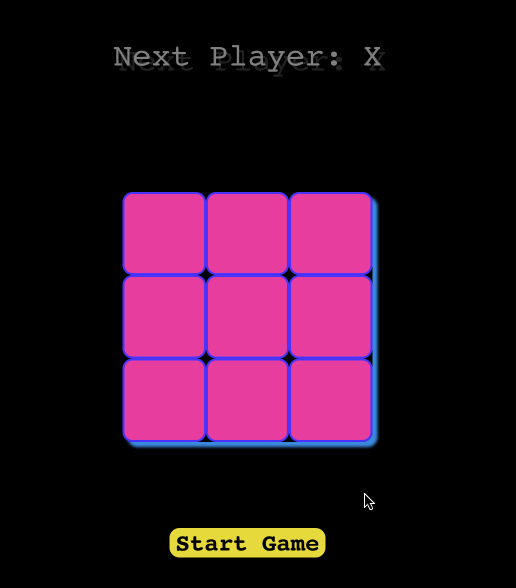

# 井字棋

开始之前，请打开编辑器。你可以在编辑器中看到以下文件。

```txt
├── public
├── src
│   ├── components
│   │   ├── common
│   │   │   └── Utils.js
│   │   ├── Board.js
│   │   ├── Game.js
│   │   └── Square.js
│   ├── App.css
│   ├── App.js
│   ├── App.test.js
│   ├── index.css
│   ├── index.js
│   ├── logo.svg
│   ├── reportWebVitals.js
│   └── setupTests.js
├── package-lock.json
└── package.json
```

## 要求

- 要安装项目依赖项，请使用以下命令：

  ```bash
  npm i
  ```

- 请在 `src/components/Game.js` 文件中完成此挑战。
- 使用 `useState` 钩子定义三个状态变量：board、xTurn 和 winner。
  - `board` 表示游戏棋盘的状态。它初始化为一个包含 9 个元素的数组，每个元素最初设置为 null。
  - `xTurn` 是一个布尔标志，指示当前是否轮到 X 下棋。
  - `winner` 存储 `calculateWinner` 函数的结果，该函数根据棋盘的当前状态确定获胜者。
- 当点击游戏棋盘上的一个方块时，会调用 `handleClick` 函数。
  - 它使用展开运算符 (`[...board]`) 创建当前棋盘状态的副本，并将其赋给 tmpBoard。
  - 如果已经有获胜者（winner 为真值）或者点击的方块已经被标记（`tmpBoard[i]` 为真值），则函数不做任何更改直接返回。
  - 否则，它会根据 `xTurn` 的值将 `tmpBoard` 中点击方块的值更新为 "X" 或 "O"。
  - 然后使用 `setBoard` 将更新后的 `tmpBoard` 设置为棋盘状态的新值，并使用 `setXTurn` 切换 xTurn 的值。

## 示例

完成代码后，使用以下命令运行它：

```bash
npm start
```

最终结果如下：


