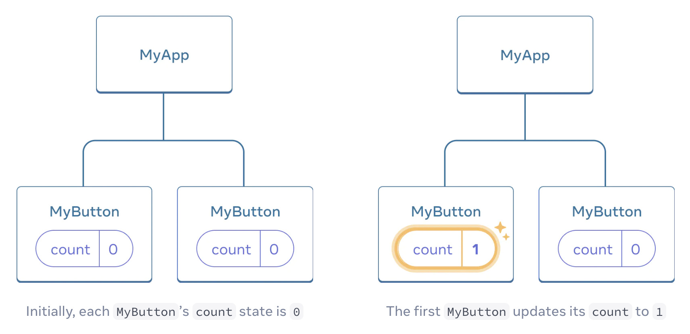
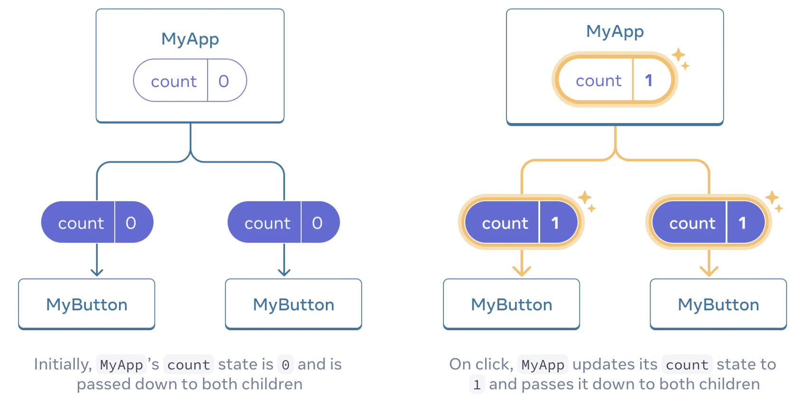

# 使用钩子

> VM 中已提供 React 项目。一般来说，你只需在 `App.js` 中添加代码。

请使用以下命令安装依赖项：

```bash
npm i
```

以 `use` 开头的函数称为钩子。`useState` 是 React 提供的一个内置钩子。你可以在 API 参考中找到其他内置钩子。你也可以通过组合现有钩子来编写自己的钩子。

钩子比其他函数的限制更多。你只能在组件顶部（或其他钩子）调用钩子。如果你想在条件语句或循环中使用 `useState`，请提取一个新组件并将其放在那里。

在前面的示例中，每个 `MyButton` 都有自己独立的 `count`，当每个按钮被点击时，只有被点击按钮的 `count` 会改变：



然而，通常你需要组件共享数据并始终一起更新。

为了使两个 `MyButton` 组件显示相同的计数并一起更新，你需要将各个按钮的状态“向上”移动到包含它们的最接近的组件。

在这个例子中，是 `MyApp`：



现在当你点击任何一个按钮时，`MyApp` 中的 `count` 会改变，这将改变 `MyButton` 中的两个计数。以下是如何在代码中表达这一点。

首先，将状态从 `MyButton` 向上移动到 `MyApp`：

```js
// App.js
export default function MyApp() {
  const [count, setCount] = useState(0);

  function handleClick() {
    setCount(count + 1);
  }

  return (
    <div>
      <h1>单独更新的计数器</h1>
      <MyButton />
      <MyButton />
    </div>
  );
}

function MyButton() {
  //... 我们将从这里移动代码...
}
```

然后，将状态从 `MyApp` 向下传递到每个 `MyButton`，同时传递共享的点击处理函数。你可以使用 JSX 花括号将信息传递给 `MyButton`，就像你之前对 `` 等内置标签所做的那样：

```js
export default function MyApp() {
  const [count, setCount] = useState(0);

  function handleClick() {
    setCount(count + 1);
  }

  return (
    <div>
      <h1>一起更新的计数器</h1>
      <MyButton count={count} onClick={handleClick} />
      <MyButton count={count} onClick={handleClick} />
    </div>
  );
}
```

你像这样传递下来的信息称为属性（props）。现在 `MyApp` 组件包含 `count` 状态和 `handleClick` 事件处理函数，并将它们作为属性传递给每个按钮。

最后，更改 `MyButton` 以读取从其父组件传递过来的属性：

```js
function MyButton({ count, onClick }) {
  return <button onClick={onClick}>已点击 {count} 次</button>;
}
```

当你点击按钮时，`onClick` 处理函数会触发。每个按钮的 `onClick` 属性都设置为 `MyApp` 内部的 `handleClick` 函数，因此其中的代码会运行。该代码调用 `setCount(count + 1)`，递增 `count` 状态变量。新的 `count` 值作为属性传递给每个按钮，所以它们都显示新值。这称为“将状态提升”。通过将状态向上移动，你在组件之间共享了它。

```js
import { useState } from "react";

export default function MyApp() {
  const [count, setCount] = useState(0);

  function handleClick() {
    setCount(count + 1);
  }

  return (
    <div>
      <h1>一起更新的计数器</h1>
      <MyButton count={count} onClick={handleClick} />
      <MyButton count={count} onClick={handleClick} />
    </div>
  );
}

function MyButton({ count, onClick }) {
  return <button onClick={onClick}>已点击 {count} 次</button>;
}
```

要运行该项目，请使用以下命令。然后，你可以刷新 **Web 8080** 标签页以预览网页。

```bash
npm start
```
